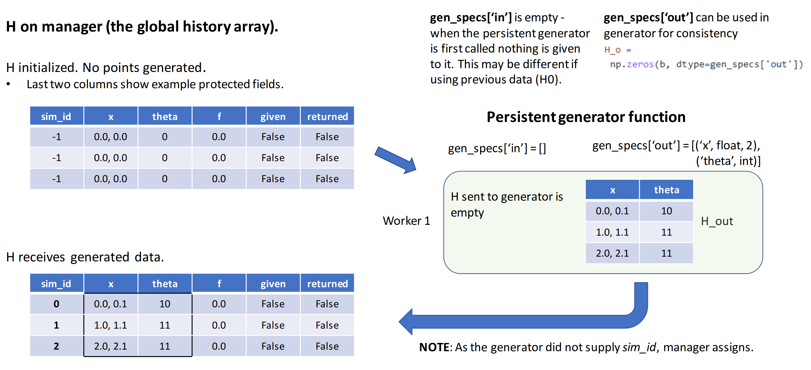
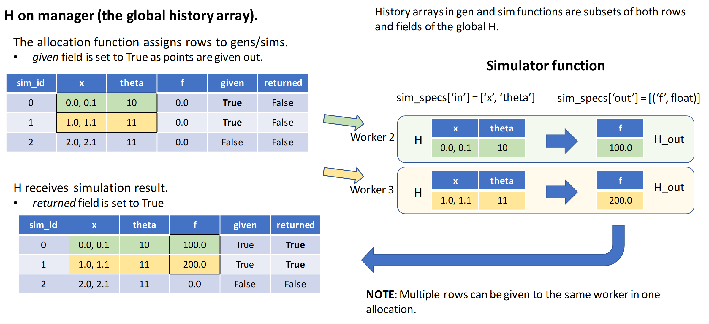
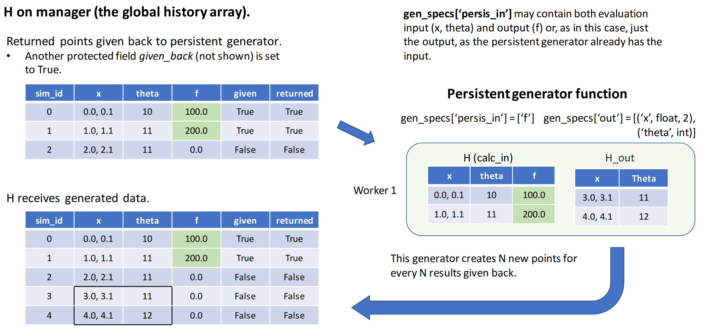

.. _datastruct-history-array:

history array
=============
::

    H: numpy structured array
        A record of runtime attributes and output data for all ensemble members.

Overview
--------

libEnsemble uses a NumPy structured array :ref:`H<datastruct-history-array>` to
store information about each point (ensemble member) generated and processed in the ensemble.
Each entry contains multiple named fields; each field can contain different
data types, including scalars, arrays, or strings.

The manager maintains the global history array for the ensemble. Each entry stores
data generated by the :ref:`gen_f<api_gen_f>` and then the resultant output from the
:ref:`sim_f<api_sim_f>`, in addition to some :ref:`reserved fields<reserved_fields>`.

When the history array is initialized, it creates fields in ``H`` for each
``gen_specs['out']`` and ``sim_specs['out']`` entry. For a simple
example these entries might be::

    gen_specs['out'] = [('x', float, 2), ('theta', int)]
    sim_specs['out'] = [('f', float)]

In this example, ``x`` is a two-dimensional coordinate, ``theta`` represents some
integer input parameter, and ``f`` is a scalar output of the simulation to be
run with the generated ``x`` and ``theta`` values.

For ease, the ``gen_f`` and ``sim_f`` are expected to return output as NumPy
structured arrays. The output from the ``gen_f`` or ``sim_f`` functions can be
the exact elements declared in the gen/sim_specs['out'] lists, or can be a
subset of these lists. (The manager's history array will update any fields
returned to it.)

The names of the input fields for ``gen_f`` and ``sim_f`` must exist in the manager's
history array (i.e.,~ they must be output fields from ``gen_f`` or ``sim_f`` or
reserved fields). The input fields must be a simple list, for example::

    sim_specs['in'] = ['x', 'theta']

.. _reserved_fields:

Reserved fields in history array
--------------------------------

The manager's history array also contains several reserved fields. These
include a ``sim_id`` to globally identify the point (on the manager this is
usually the same as the array index). The ``sim_id`` can be provided by the
user from the ``gen_f``, but is otherwise assigned by the manager as generated
points are received.

The reserved boolean field ``cancel_requested`` can also be set in a user
function to request that libEnsemble cancels evaluation of the point.

The remaining reserved fields are protected (populated by libEnsemble), and
store information about each entry. These include boolean fields for the
current scheduling status of the point (``sim_started`` when the sim evaluation
has started out, ``sim_ended`` when sim evaluation has completed, and
``gen_informed`` when the sim output has been passed back to the generator).
Timing fields give the time (since the epoch) corresponding to each state, and
when the point was generated. Other protected fields include the worker IDs on
which points were generated or evaluated.

The user fields and the reserved fields together make up the final history array
returned by libEnsemble.

The full list of these reserved fields is given below.

* ``sim_id`` [int]: Each unit of work output from ``gen_f`` must have an
  associated ``sim_id``. The generator can assign this, but users must be
  careful to ensure that points are added in order. For example, if ``alloc_f``
  allows for two ``gen_f`` instances to be running simultaneously, ``alloc_f``
  should ensure that both don’t generate points with the same ``sim_id``.
  If the generator does not provide, then a ``sim_id`` will be assigned by the
  manager as generated points are received.

* ``cancel_requested`` [bool]: True if the cancellation of the ``sim_f`` evaluation of this
  entry was requested. This field can be set by the user in a user function.

:*Protected fields*:

``gen_worker`` [int]: Worker that generated this entry

``gen_started_time`` [float]: Time gen_worker was initiated that produced this entry

``gen_ended_time`` [float]: Time gen_worker requested this entry

``sim_worker`` [int]: Worker that did (or is doing) the sim evaluation for this entry

``sim_started`` [bool]: True if entry was given to sim_worker for sim evaluation

``sim_started_time`` [float]: Time entry was given to sim_worker for a sim evaluation

``sim_ended`` [bool]: True if entry's sim evaluation completed

``sim_ended_time`` [float]: Time entry's sim evaluation completed

``gen_informed`` [bool]: True if gen_worker was informed about the sim evaluation of this entry

``gen_informed_time`` [float]: Time gen_worker was informed about the sim evaluation of this entry

``kill_sent`` [bool]: True if a kill signal was sent to worker for this entry

Other than ``'sim_id'`` and ``cancel_requested``, reserved fields cannot be
overwritten by user functions unless ``libE_specs['safe_mode']`` is set to ``False``.

.. warning::
  Adjusting values in protected fields may crash libEnsemble.

Example workflow updating history array
---------------------------------------

**Step 1**: The history array is initialized on the manager

The history array is initialized using the libEnsemble reserved field and the
user-provided ``gen_specs['out']`` and ``sim_specs['out']`` entries.
In the figure below, only the
reserved fields: ``sim_id``, ``sim_started``, and ``sim_ended`` are shown for brevity.

    .. figure:: ../images/history_init.png
       :scale: 40
       :align: center

|

:ref:`gen_f<api_gen_f>` and :ref:`sim_f<api_sim_f>` functions accept a local history
array as the first argument (this contains only the rows and fields sent to the function.
For new function calls these will be specified by either ``gen_specs['in']``  or
``sim_specs['in']``. For generators this may be empty.

|

**Step 2**: Persistent generator ``gen_f`` is called

|

**Step 3**: Points are given out for ``sim_f`` to evaluate

|

**Step 4**: Results returned to persistent generator ``gen_f``

|
