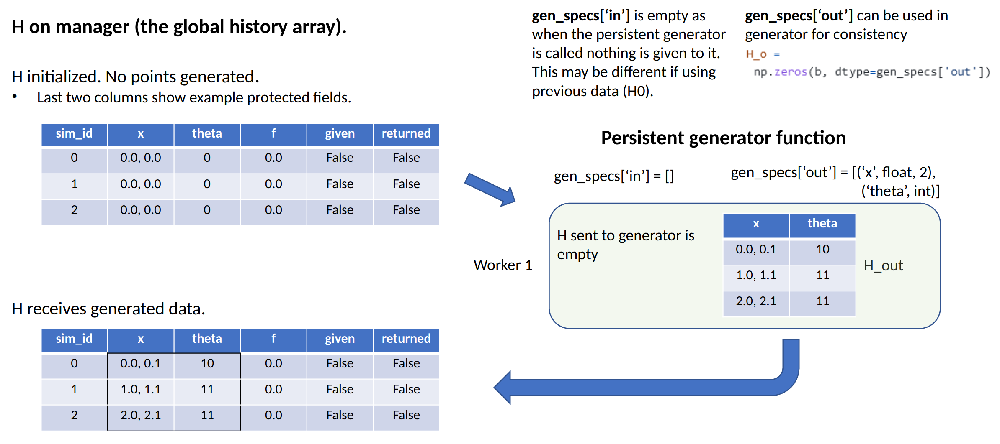
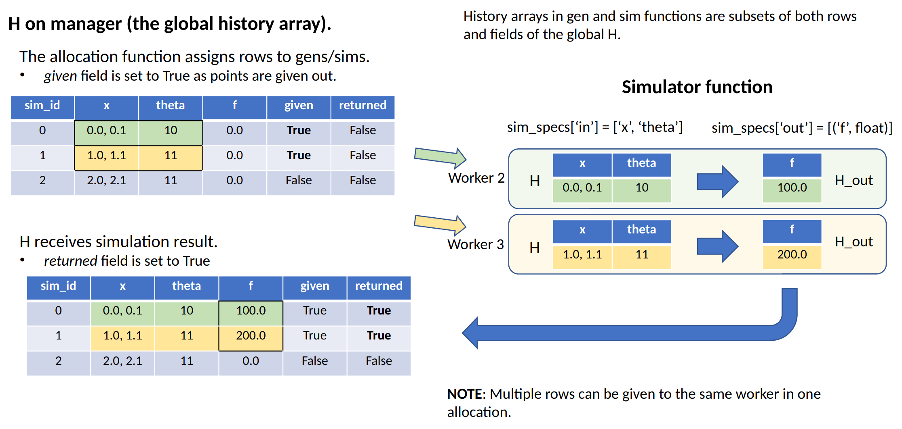
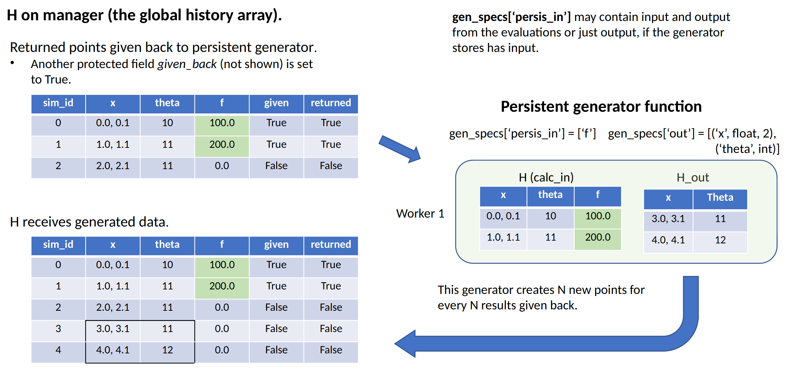

.. _funcguides-history:

History Array
=============
::

    H: numpy structured array
        A record of runtime attributes and output data for all ensemble members.

Overview
--------

libEnsemble uses a NumPy structured array to store information about each point
(ensemble member) generated and processed in the ensemble.

The manager maintains a global copy. Each row contains:

  1. Data generated by the :ref:`gen_f<api_gen_f>`
  2. Resultant output from the :ref:`sim_f<api_sim_f>`
  3. :ref:`Reserved fields<reserved_fields>` containing metadata

When the history array is initialized, it creates fields for each
``gen_specs["out"]`` and ``sim_specs["out"]`` entry. These entries may resemble::

    gen_specs["out"] = [("x", float, 2), ("theta", int)]
    sim_specs["out"] = [("f", float)]

.. In this example, ``x`` is a two-dimensional coordinate, ``theta`` represents some
.. integer input parameter, and ``f`` is a scalar output of the simulation to be
.. run with the generated ``x`` and ``theta`` values.

Therefore, the ``gen_f`` and ``sim_f`` must return output as NumPy
structured arrays for slotting into these fields.

.. (The manager's history array will update any fields
.. returned to it.)

Ensure input/output field names for a function match each other or a :ref:`reserved field<reserved_fields>`::

    gen_specs["out"] = [("x", float, 2), ("theta", int)]  # produces "x" and "theta"
    sim_specs["in"] = ["x", "theta", "sim_id"]  # accepts "x", "theta" and "sim_id", a reserved field

.. _reserved_fields:

Reserved Fields
---------------

User fields and reserved fields are combined together in the final History
array returned by libEnsemble.

.. Automatically tracked fields within the History array include:

..   1. ``sim_id``, to globally identify the point. Assigned by manager if the generator doesn't provide.
..   2. ``cancel_requested``,

.. The manager's history array also contains several reserved fields. These
.. include a ``sim_id`` to globally identify the point (on the manager this is
.. usually the same as the array index). The ``sim_id`` can be provided by the
.. user from the ``gen_f``, but is otherwise assigned by the manager as generated
.. points are received.

.. The reserved boolean field ``cancel_requested`` can also be set in a user
.. function to request that libEnsemble cancels the evaluation of the point.

.. The remaining reserved fields are protected (populated by libEnsemble), and
.. store information about each entry. These include boolean fields for the
.. current scheduling status of the point (``sim_started`` when the sim evaluation
.. has started out, ``sim_ended`` when sim evaluation has completed, and
.. ``gen_informed`` when the sim output has been passed back to the generator).
.. Timing fields give the time (since the epoch) corresponding to each state, and
.. when the point was generated. Other protected fields include the worker IDs on
.. which points were generated or evaluated.

.. The user fields and the reserved fields together make up the final history array
.. returned by libEnsemble.

These reserved fields can be modified to adjust how/when a point is evaluated:

* ``sim_id`` [int]: Each unit of work must have a ``sim_id``. This can be set by the
  generator or by the manager by default. Users should ensure these IDs are sequential
  and unique when running multiple generators.

.. *  The generator can assign this, but users must be
..   careful to ensure that points are added in order. For example, if ``alloc_f``
..   allows for two ``gen_f`` instances to be running simultaneously, ``alloc_f``
..   should ensure that both don't generate points with the same ``sim_id``.
..   If the generator does not provide, then a ``sim_id`` will be assigned by the
..   manager as generated points are received.

* ``cancel_requested`` [bool]: Can be set ``True`` in a generator to request attempted
  cancellation of the corresponding simulation.

The following fields are automatically populated by libEnsemble:

``gen_worker`` [int]: Worker that generated this entry

``gen_started_time`` [float]: Time gen_worker was initiated that produced this entry

``gen_ended_time`` [float]: Time gen_worker requested this entry

``sim_worker`` [int]: Worker that did (or is doing) the sim evaluation for this entry

``sim_started`` [bool]: ``True`` if entry was given to sim_worker for sim evaluation

``sim_started_time`` [float]: Time entry was given to sim_worker for a sim evaluation

``sim_ended`` [bool]: ``True`` if entry's sim evaluation completed

``sim_ended_time`` [float]: Time entry's sim evaluation completed

``gen_informed`` [bool]: ``True`` if gen_worker was informed about the sim evaluation of this entry

``gen_informed_time`` [float]: Time gen_worker was informed about the sim evaluation of this entry

``kill_sent`` [bool]: ``True`` if a kill signal was sent to worker for this entry

Other than ``"sim_id"`` and ``cancel_requested``, these fields cannot be
overwritten by user functions unless ``libE_specs["safe_mode"]`` is set to ``False``.

.. warning::
  Adjusting values in protected fields may crash libEnsemble.

Example Workflow updating History
---------------------------------

**Step 1**: The history array is initialized on the manager

The history array is initialized using the libEnsemble reserved field and the
user-provided ``gen_specs["out"]`` and ``sim_specs["out"]`` entries.
In the figure below, only the
reserved fields: ``sim_id``, ``sim_started``, and ``sim_ended`` are shown for brevity.

    .. figure:: ../images/history_init.png
       :scale: 40
       :align: center

|

:ref:`gen_f<api_gen_f>` and :ref:`sim_f<api_sim_f>` functions accept a local history
array as the first argument that contains only the rows and fields specified.
For new function calls these will be specified by either ``gen_specs["in"]``  or
``sim_specs["in"]``. For generators this may be empty.

|

**Step 2**: Persistent generator ``gen_f`` is called

|

**Step 3**: Points are given out for ``sim_f`` to evaluate

|

**Step 4**: Results returned to persistent generator ``gen_f``

|
