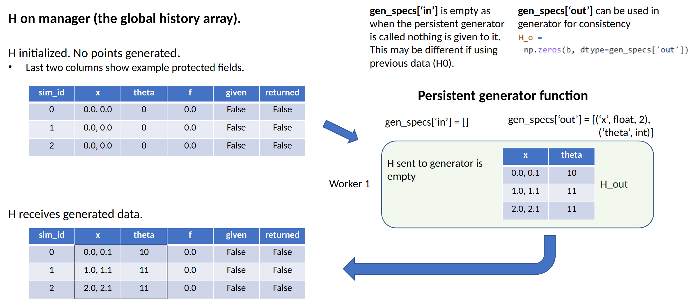
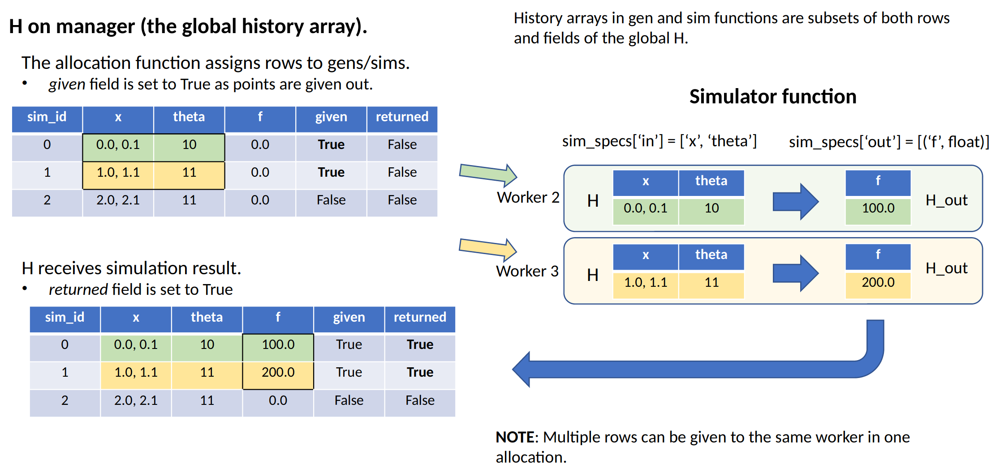
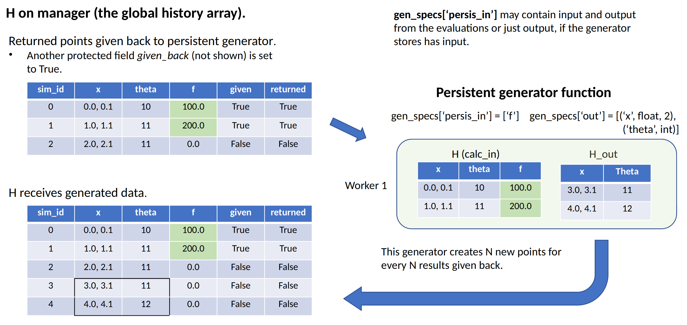

.. _funcguides-history:

History Array
=============
::

    H: numpy structured array
        A record of runtime attributes and output data for all ensemble members.

Overview
--------

libEnsemble uses a NumPy structured array to store information about each point
(ensemble member) generated and processed in the ensemble.

The manager maintains a global copy. Each row contains:

  1. Data generated by the :ref:`generator<funcguides-gen>`
  2. Resultant output from the :ref:`simulator function<funcguides-sim>`
  3. :ref:`Reserved fields<reserved_fields>` containing metadata

**Simulator functions** (``sim_f``) must return their data as arrays with the same
dtype as ``sim_specs["out"]``. Alternatively, a ``simulator``
callable in gest-api format (accepting and returning a ``dict``) can be provided via
``SimSpecs.simulator``; libEnsemble wraps it automatically and handles the dtype
conversion.

**Generators** that adhere to the ``gest_api`` standard implement ``suggest()`` and
``ingest()`` methods that operate on lists of Python dictionaries. libEnsemble
automatically casts their ``dict`` outputs to NumPy for inclusion in the History array.

When using a ``VOCS`` object (from ``gest_api.vocs``) to parameterize ``GenSpecs`` or
``SimSpecs``, field names in the History array are derived automatically from the VOCS
variable, objective, and constraint keys. ``LibensembleGenerator`` subclasses optionally
collapse all VOCS variables into a single ``"x"`` array field (and objectives into
``"f"``) unless an explicit ``variables_mapping`` is provided.

Ensure input/output field names for a function match each other or a :ref:`reserved field<reserved_fields>`::

    gen_specs["out"] = [("x", float, 2), ("theta", int)]  # produces "x" and "theta"
    sim_specs["in"] = ["x", "theta", "sim_id"]  # accepts "x", "theta" and "sim_id", a reserved field

.. _reserved_fields:

Reserved Fields
---------------

User fields and reserved fields are combined together in the final History
array returned by libEnsemble.

These reserved fields can be modified to adjust how/when a point is evaluated:

* ``sim_id`` [int]: Each unit of work must have a ``sim_id``. This can be set by the
  generator or by the manager by default. Users should ensure these IDs are sequential
  and unique when running multiple generators.

* ``cancel_requested`` [bool]: Can be set ``True`` in a generator to request attempted
  cancellation of the corresponding simulation.

The following fields are automatically populated by libEnsemble:

``gen_worker`` [int]: Worker that generated this entry

``gen_started_time`` [float]: Time gen_worker was initiated that produced this entry

``gen_ended_time`` [float]: Time gen_worker requested this entry

``sim_worker`` [int]: Worker that did (or is doing) the sim evaluation for this entry

``sim_started`` [bool]: ``True`` if entry was given to sim_worker for sim evaluation

``sim_started_time`` [float]: Time entry was given to sim_worker for a sim evaluation

``sim_ended`` [bool]: ``True`` if entry's sim evaluation completed

``sim_ended_time`` [float]: Time entry's sim evaluation completed

``gen_informed`` [bool]: ``True`` if gen_worker was informed about the sim evaluation of this entry

``gen_informed_time`` [float]: Time gen_worker was informed about the sim evaluation of this entry

``kill_sent`` [bool]: ``True`` if a kill signal was sent to worker for this entry

Other than ``"sim_id"`` and ``"cancel_requested"``, these fields cannot be
overwritten by user functions when ``libE_specs["safe_mode"]`` is set to ``True``
(protection is opt-in; the default value of ``safe_mode`` is ``False``).

Example Workflow updating History
---------------------------------

**Step 1**: The history array is initialized on the manager

The history array is initialized using the libEnsemble reserved field and the
user-provided ``gen_specs["out"]`` and ``sim_specs["out"]`` entries.
In the figure below, only the
reserved fields: ``sim_id``, ``sim_started``, and ``sim_ended`` are shown for brevity.

    .. figure:: ../images/history_init.png
       :scale: 40
       :align: center

|

For legacy generator functions (``gen_f``), the function accepts a local history
array slice as the first argument containing only the rows and fields specified by
``gen_specs["in"]`` (may be empty). It returns a NumPy structured array that
libEnsemble writes into H.

For gest-api generators, ``suggest(n)`` returns a list of dicts and ``ingest(results)``
receives a list of dicts; libEnsemble handles all conversions to and from NumPy.

|

**Step 2**: Persistent generator ``gen_f`` is called

|

**Step 3**: Points are given out for ``sim_f`` to evaluate

|

**Step 4**: Results returned to persistent generator ``gen_f``

|
