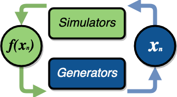
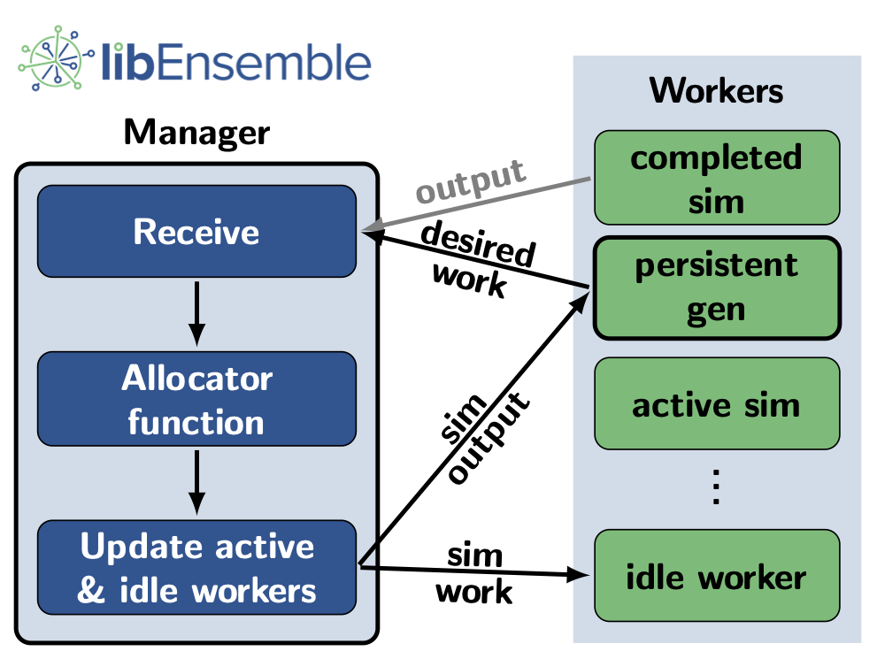

Understanding libEnsemble
=========================

Manager, Workers, Generators, and Simulators
~~~~~~~~~~~~~~~~~~~~~~~~~~~~~~~~~~~~~~~~~~~~
.. begin_overview_rst_tag

libEnsemble's **manager** allocates work to **workers**,
which perform computations via **generators** and **simulators**:

* :ref:`generator<api_gen_f>`: Generates inputs for the *simulator*
* :ref:`simulator<api_sim_f>`: Performs an evaluation using parameters from the *generator*

|

|

An :doc:`executor<executor/overview>` interface is available so generators and simulators
can launch and monitor external applications.

libEnsemble uses a NumPy structured array called the :ref:`history array<funcguides-history>`
to record all simulations and generated values.

Allocator Function
~~~~~~~~~~~~~~~~~~

* :ref:`allocator<api_alloc_f>`: Decides whether a simulator or generator should be
  invoked (and with what inputs/resources) as workers become available

The default allocator (``alloc_f``) prompts workers to run the highest-priority simulator work.
If a worker is idle and no simulator work is available, that worker is prompted to query the generator.

The default allocator is appropriate for the majority of use cases but can be customized
for users interested in more advanced allocation strategies.

Example Use Cases
~~~~~~~~~~~~~~~~~
.. begin_usecases_rst_tag

Below are some expected libEnsemble use cases that we support (or are working
to support):

.. dropdown:: **Click Here for Use-Cases**

  * A user wants to optimize a simulation calculation. The simulation may
    already be using parallel resources but not a large fraction of a 
    computer. libEnsemble can coordinate concurrent evaluations of the 
    simulation ``sim_f`` at multiple parameter values based on candidate parameter
    values produced by ``gen_f`` (possibly after each ``sim_f`` output).

  * A user has a ``gen_f`` that produces meshes for a
    ``sim_f``. Based on the ``sim_f`` output, the ``gen_f`` can refine a mesh or
    produce a new mesh. libEnsemble ensures that generated meshes can be
    reused by multiple simulations without requiring data movement.

  * A user wants to evaluate a simulation ``sim_f`` with different sets of
    parameters, each drawn from a set of possible values. Some parameter values
    are known to cause the simulation to fail. libEnsemble can stop
    unresponsive evaluations and recover computational resources for future
    evaluations. The ``gen_f`` can update the sampling strategy after discovering
    regions where evaluations of ``sim_f`` fail.

  * A user has a simulation ``sim_f`` that requires calculating multiple
    expensive quantities, some of which depend on other quantities. The ``sim_f``
    can monitor intermediate quantities to stop related calculations early and
    preempt future calculations associated with poor parameter values.

  * A user has a ``sim_f`` with multiple fidelities, where higher-fidelity
    evaluations require more computational resources. A ``gen_f``/``alloc_f``
    pair decides which parameters should be evaluated and
    at what fidelity level. libEnsemble coordinates these evaluations without
    requiring the user to write parallel code.

  * A user wishes to identify multiple local optima for a ``sim_f``. In addition,
    sensitivity analysis is desired at each identified optimum. libEnsemble can
    use points from the APOSMM ``gen_f`` to identify optima. After a point is
    determined to be an optimum, a different ``gen_f`` can generate the
    parameter sets required for sensitivity analysis of ``sim_f``.

  Combinations of these use cases are also supported. For example, libEnsemble
  can be used to solve optimization problems where simulations fail
  frequently.

Glossary
~~~~~~~~

Here we define some terms used throughout libEnsemble's code and documentation.
Although many of these terms seem straightforward, defining them helps reduce
confusion when communicating about libEnsemble and
its capabilities.

.. dropdown:: **Click Here for Glossary**
  :open:

  * **Manager**: A single libEnsemble process that facilitates communication between
    other processes. The *Manager* configures and distributes work to
    workers and collects their output.

  * **Worker**: libEnsemble processes responsible for performing units of work,
    which may include executing tasks or submitting external jobs. Workers run
    generation and simulation routines and return results to the manager.

  * **Calling Script**: libEnsemble is typically imported, parameterized, and
    initiated in a single Python file referred to as a *calling script*. ``sim_f``
    and ``gen_f`` functions are commonly configured and parameterized here.

  * **User function**: A generator, simulator, or allocation function. These
    Python functions govern the libEnsemble workflow. They
    must conform to the libEnsemble API for each respective user function, but otherwise can
    be created or modified by the user. 
    libEnsemble includes many examples of each type.

  * **Executor**: The executor provides a simple, portable interface for
    launching and managing user tasks (applications). Multiple executors are
    available, including the base ``Executor`` and ``MPIExecutor``.

  * **Submit**: To enqueue or indicate that one or more jobs or tasks should be
    launched. When using the libEnsemble Executor, a *submitted* task is either executed
    immediately or queued for execution.

  * **Tasks**: Subprocesses or independent units of work. Workers perform
    tasks as directed by the manager. Tasks may include launching external
    programs for execution using the Executor.

  * **Persistent**: Typically, a worker communicates with the manager
    before and after initiating a user ``gen_f`` or ``sim_f`` calculation. Persistent user
    functions instead communicate directly with the manager during execution,
    allowing them to maintain and update data structures efficiently. These
    calculations and their assigned workers are referred to as *persistent*.

  * **Resource Manager**: libEnsemble includes a built-in resource manager that can detect 
    (or be provided with) available resources (e.g., a node list). Resources are
    divided among workers using *resource sets* and can be dynamically
    reassigned.

  * **Resource Set**: The smallest unit of resources that can be assigned (and
    dynamically reassigned) to workers. By default this is the provisioned resources
    divided by the number of workers (excluding any workers listed in the 
    ``zero_resource_workers`` ``libE_specs`` option). It can also be set
    explicitly using the ``num_resource_sets`` ``libE_specs`` option.

  * **Slot**: Resource sets enumerated on a node (starting from zero). If
    a resource set spans multiple nodes, each node is considered to have slot
    zero.
