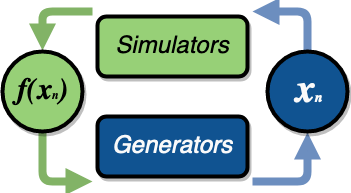

Understanding libEnsemble
=========================

Manager, Workers, and User Functions
~~~~~~~~~~~~~~~~~~~~~~~~~~~~~~~~~~~~
.. begin_overview_rst_tag

libEnsemble's **manager** allocates work to **workers**,
which perform computations via **user functions**:

* :ref:`generator<api_gen_f>`: Generates inputs to the *simulator* (``sim_f``)
* :ref:`simulator<api_sim_f>`: Performs an evaluation based on parameters from the *generator* (``gen_f``)
* :ref:`allocator<api_alloc_f>`: Decides whether a simulator or generator should be
  called (and with what inputs/resources) as workers become available

|

The default allocator (``alloc_f``) instructs workers to run the simulator on the
highest priority work from the generator. If a worker is idle and there is
no work, that worker is instructed to call the generator.

.. figure:: images/diagram_with_persis.png
 :alt: libE component diagram
 :align: center
 :scale: 40

|

An :doc:`executor<executor/overview>` interface is available so user functions
can execute and monitor external applications.

libEnsemble uses a NumPy structured array known as the :ref:`history array<funcguides-history>`
to keep a record of all simulations. The global history array is stored on the
manager, while selected rows and fields of this array are passed to and from user functions.

Example Use Cases
~~~~~~~~~~~~~~~~~
.. begin_usecases_rst_tag

Below are some expected libEnsemble use cases that we support (or are working
to support):

.. dropdown:: **Click Here for Use-Cases**

  * A user wants to optimize a simulation calculation. The simulation may
    already be using parallel resources but not a large fraction of some
    computer. libEnsemble can coordinate the concurrent evaluation of the
    simulation ``sim_f`` at various parameter values based on candidate parameter
    values from ``gen_f`` (possibly after each ``sim_f`` output).

  * A user has a ``gen_f`` that produces meshes for a
    ``sim_f``. Given the ``sim_f`` output, the ``gen_f`` can refine a mesh or
    produce a new mesh. libEnsemble can ensure that the calculated meshes can be
    used by multiple simulations without requiring moving data.

  * A user wants to evaluate a simulation ``sim_f`` with different sets of
    parameters, each drawn from a set of possible values. Some parameter values
    are known to cause the simulation to fail. libEnsemble can stop
    unresponsive evaluations and recover computational resources for future
    evaluations. The ``gen_f`` can possibly update the sampling after discovering
    regions where evaluations of ``sim_f`` fail.

  * A user has a simulation ``sim_f`` that requires calculating multiple
    expensive quantities, some of which depend on other quantities. The ``sim_f``
    can observe intermediate quantities to stop related calculations and
    preempt future calculations associated with poor parameter values.

  * A user has a ``sim_f`` with multiple fidelities, with the higher-fidelity
    evaluations requiring more computational resources, and a
    ``gen_f``/``alloc_f`` that decides which parameters should be evaluated and
    at what fidelity level. libEnsemble can coordinate these evaluations without
    requiring the user to know parallel programming.

  * A user wishes to identify multiple local optima for a ``sim_f``. Furthermore,
    sensitivity analysis is desired at each identified optimum. libEnsemble can
    use the points from the APOSMM ``gen_f`` to identify optima; and after a
    point is ruled to be an optimum, a different ``gen_f`` can produce a
    collection of parameters necessary for sensitivity analysis of ``sim_f``.

  Combinations of these use cases are supported as well. An example of
  such a combination is using libEnsemble to solve an optimization problem that
  relies on simulations that fail frequently.

Glossary
~~~~~~~~

Here we define some terms used throughout libEnsemble's code and documentation.
Although many of these terms seem straightforward, defining such terms assists
with keeping confusion to a minimum when communicating about libEnsemble and
its capabilities.

.. dropdown:: **Click Here for Glossary**
  :open:

  * **Manager**: Single libEnsemble process facilitating communication between
    other processes. Within libEnsemble, the *Manager* process configures and
    passes work to and from the workers.

  * **Worker**: libEnsemble processes responsible for performing units of work,
    which may include submitting or executing tasks. *Worker* processes run
    generation and simulation routines, submit additional tasks for execution,
    and return results to the manager.

  * **Calling Script**: libEnsemble is typically imported, parameterized, and
    initiated in a single Python file referred to as a *calling script*. ``sim_f``
    and ``gen_f`` functions are also commonly configured and parameterized here.

  * **User function**: A generator, simulator, or allocation function. These
    are Python functions that govern the libEnsemble workflow. They
    must conform to the libEnsemble API for each respective user function, but otherwise can
    be created or modified by the user. libEnsemble comes with many examples of
    each type of user function.

  * **Executor**: The executor can be used within user functions to provide a
    simple, portable interface for running and managing user tasks (applications).
    There are multiple executors including the base ``Executor`` and ``MPIExecutor``.

  * **Submit**: Enqueue or indicate that one or more jobs or tasks need to be
    launched. When using the libEnsemble Executor, a *submitted* task is executed
    immediately or queued for execution.

  * **Tasks**: Sub-processes or independent units of work. Workers perform
    *tasks* as directed by the manager; tasks may include submitting external
    programs for execution using the Executor.

  * **Persistent**: Typically, a worker communicates with the manager
    before and after initiating a user ``gen_f`` or ``sim_f`` calculation. However, user
    functions may also be constructed to communicate directly with the manager,
    for example, to efficiently maintain and update data structures instead of
    communicating them between manager and worker. These calculations
    and the workers assigned to them are referred to as *persistent*.

  * **Resource Manager** libEnsemble has a built-in resource manager that can detect
    (or be provided with) a set of resources (e.g., a node-list). Resources are
    divided up among workers (using *resource sets*) and can be dynamically
    reassigned.

  * **Resource Set**: The smallest unit of resources that can be assigned (and
    dynamically reassigned) to workers. By default it is the provisioned resources
    divided by the number of workers (excluding any workers given in the
    ``zero_resource_workers`` libE_specs option). However, it can also be set
    directly by the ``num_resource_sets`` libE_specs option.

  * **Slot**: The ``resource sets`` enumerated on a node (starting with zero). If
    a resource set has more than one node, then each node is considered to have slot
    zero.
