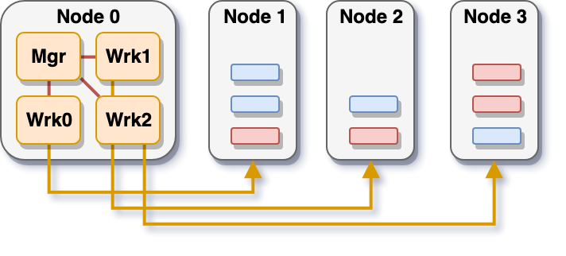
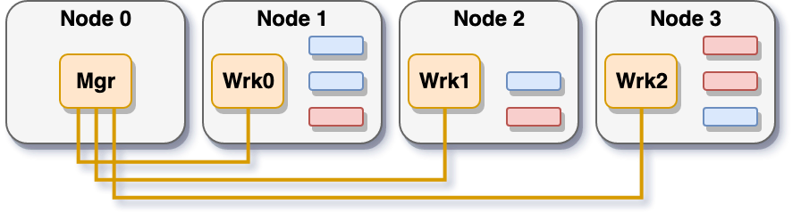

Running on HPC Systems
======================

libEnsemble has been developed, supported, and tested on systems of highly varying
scales, from laptops to thousands of compute-nodes. libEnsemble's hugely parallel
scaling capabilities are most productive with the resources available within
high-performance machines.

Across allocated compute nodes, libEnsemble's flexible architecture lends itself
best to two general modes of worker distributions. The first mode we refer
to as **centralized** mode, where the libEnsemble manager and worker processes
are grouped on one or more nodes, but through the libEnsemble job-controller or a
job-launch command can execute calculations on the other allocated nodes:

Alternatively, in **distributed** mode, each worker process runs independently of
other workers directly on one or more allocated nodes:

.. note::

    Certain machines (like Theta and Summit) that can only submit MPI jobs from
    specialized launch nodes do not support libEnsemble in distributed mode.

Due to this factor, libEnsemble on Theta and Summit approaches centralized mode
differently. On these machines, libEnsemble is run centralized on either a
compute-node with the support of Balsam_, a frontend MOM
(Machine-Oriented Mini-server) node on Theta, or a launch node on Summit.

Read more about configuring and launching libEnsemble on some HPC systems:

.. toctree::
    :maxdepth: 2
    :titlesonly:

    bebop
    cori
    theta
    summit
    example_scripts

.. _Balsam: https://balsam.readthedocs.io/en/latest/
