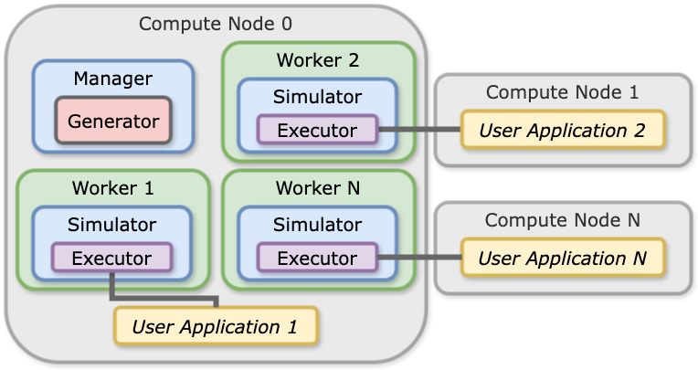
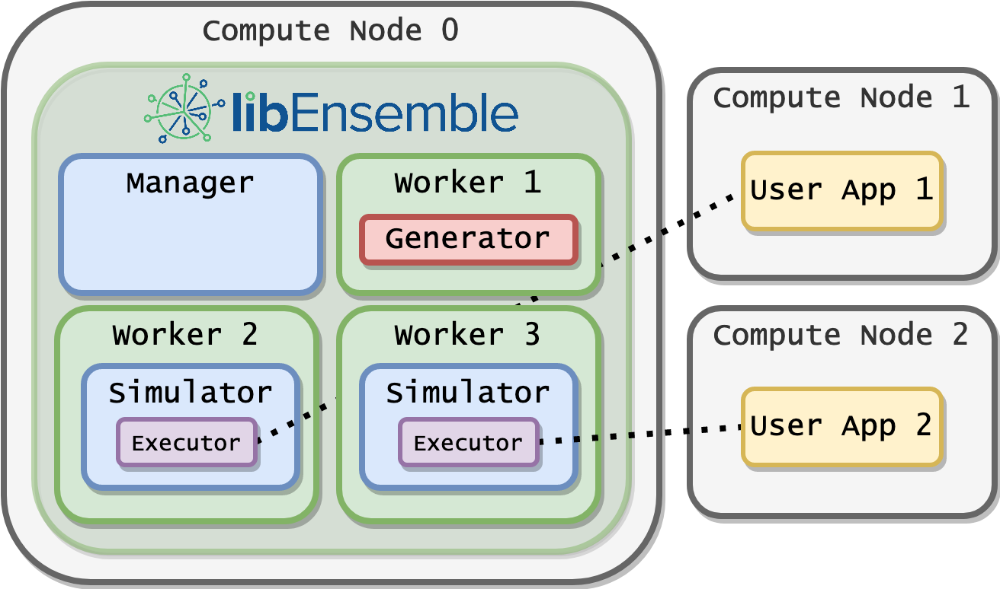

.. _platform-index:

Running on HPC Systems
======================

libEnsemble has been tested on systems of highly varying scales, from laptops to
thousands of compute nodes. On multi-node systems, there are a few alternative
ways of configuring libEnsemble to run and launch tasks (i.e., user applications)
on the available nodes.

The :doc:`Forces tutorial <../../tutorials/executor_forces_tutorial>` gives an
example with a simple MPI application.

Note that while the diagrams below show one application being run per node,
configurations with **multiple nodes per worker** or **multiple workers per node**
are both common use cases.

Centralized Running
-------------------

The default communications scheme places the manager and workers on the first node.
The :doc:`MPI Executor<../executor/ex_index>` can then be invoked by each
simulation worker, and libEnsemble will distribute user applications across the
node allocation. This is the **most common approach** where each simulation
runs an MPI application.

A SLURM batch script may include:

.. code-block:: bash

    #SBATCH --nodes 3

    python run_libe_forces.py --nworkers 3

If running multiple generator processes instead, then set the
:ref:`libE_specs<datastruct-libe-specs>` option **gen_on_worker** so that multiple
worker processes can run multiple generator instances.

Dedicated Mode
^^^^^^^^^^^^^^

If the :ref:`libE_specs<datastruct-libe-specs>` option **dedicated_mode** is set to
True, the MPI executor will not launch applications on nodes where libEnsemble Python
processes (manager and workers) are running. Workers launch applications onto the
remaining nodes in the allocation.

In calling script:

.. code-block:: python
    :linenos:

    ensemble.libE_specs = LibeSpecs(
        gen_on_worker=True,
        num_resource_sets=2,
        dedicated_mode=True,
    )

A SLURM batch script may include:

.. code-block:: bash

    #SBATCH --nodes 3

    python run_libe_forces.py --nworkers 3

Distributed Running
-------------------

In the **distributed** approach, libEnsemble can be run using the **mpi4py**
communicator, with workers distributed across nodes. This is most often used
when workers run simulation code directly, via a Python interface. The user
script is invoked with an MPI runner, for example (using an `mpich`-based MPI)::

    mpirun -np 4 -ppn 1 python myscript.py

The distributed approach, can also be used with the executor, to co-locate workers
with the applications they submit. Ensuring that workers are placed as required in this
case requires :ref:`a careful MPI rank placement <slurm_mpi_distributed>`.

    .. image:: ../images/distributed_new_detailed.png
        :alt: distributed
        :scale: 30
        :align: center

This allows the libEnsemble worker to read files produced by the application on
local node storage.

Configuring the Run
-------------------

On systems with a job scheduler, libEnsemble is typically run within a single
:doc:`job submission<example_scripts>`. All user simulations will run on
the nodes within that allocation.

*How does libEnsemble know where to run tasks (user applications)?*

The libEnsemble :doc:`MPI Executor<../executor/ex_index>` can be initialized from the user calling
script, and then used by workers to run tasks. The Executor will automatically detect the nodes
available on most systems. Alternatively, the user can provide a file called **node_list** in
the run directory. By default, the Executor will divide up the nodes evenly to each worker.

Mapping Tasks to Resources
--------------------------

The :ref:`resource manager<resources_index>` detects node lists from
:ref:`common batch schedulers<resource_detection>`,
and partitions these to workers. The :doc:`MPI Executor<../executor/ex_index>`
accesses the resources available to the current worker when launching tasks.

Assigning GPUs
--------------

libEnsemble automatically detects and assigns Nvidia, AMD, and Intel GPUs without modifying the user scripts. This automatically works on many systems, but if the assignment is incorrect or needs to be modified the user can specify :ref:`platform information<datastruct-platform-specs>`.
The :doc:`forces_gpu tutorial<../tutorials/forces_gpu_tutorial>` shows an example of this.

Varying resources
-----------------

libEnsemble also features :ref:`dynamic resource assignment<var-resources-gpu>`, whereby the
number of processes and/or the number of GPUs can be a set for each simulation by the generator.

Overriding Auto-Detection
-------------------------

libEnsemble can automatically detect system information. This includes resource information, such as
available nodes and the number of cores on the node, and information about available MPI runners.

System detection for resources can be overridden using the :ref:`resource_info<resource_info>`
libE_specs option.

When using the MPI Executor, it is possible to override the detected information using the
`custom_info` argument. See the :doc:`MPI Executor<../executor/ex_index>` for more.

Systems with Launch/MOM Nodes
-----------------------------

Some large systems have a 3-tier node setup. That is, they have a separate set of launch nodes
(known as MOM nodes on Cray Systems). User batch jobs or interactive sessions run on a launch node.
Most such systems supply a special MPI runner that has some application-level scheduling
capability (e.g., ``aprun``, ``jsrun``). MPI applications can only be submitted from these nodes.

There are two ways of running libEnsemble on these kinds of systems. The first, and simplest,
is to run libEnsemble on the launch nodes. This is often sufficient if the worker's simulation
or generation functions are not doing much work (other than launching applications). This approach
is inherently centralized. The entire node allocation is available for the worker-launched
tasks.

However, running libEnsemble on the compute nodes is potentially more scalable and
will better manage simulation and generation functions that contain considerable
computational work or I/O. Therefore the second option is to use Globus Compute
to isolate this work from the workers.

.. _globus_compute_ref:

Globus Compute - Remote User Functions
--------------------------------------

`Globus Compute`_ (formerly funcX) is a distributed, high-performance
function-as-a-service platform. When libEnsemble is running on a resource with
internet access (laptops, login nodes, other servers, etc.), it can offload
simulator calls to remote Globus Compute endpoints:

    .. image:: ../images/funcxmodel.png
        :alt: running_with_globus_compute
        :scale: 50
        :align: center

This is useful for running ensembles across machines and heterogeneous resources.
There are **three approaches**, described below.

The following caveats apply to all Globus Compute modes:

    1. Simulator functions submitted to Globus Compute must be *non-persistent*,
       since manager-worker communicators cannot be serialized or used by a
       remote resource.

    2. ``Executor.manager_poll()`` is not available inside remotely executed
       functions. Control over remote work is limited to inspecting return
       values and exceptions when tasks complete.

    3. Globus Compute imposes a `handful of task-rate and data limits`_ on
       submitted functions.

    4. Users are responsible for authenticating via Globus_ and maintaining their
       `Globus Compute endpoints`_ on their target systems.

.. _gc_only_mode:

Manager-side GC (GC-only mode)
^^^^^^^^^^^^^^^^^^^^^^^^^^^^^^^

The recommended approach for most use cases. When
``globus_compute_endpoint`` is set in :class:`SimSpecs<libensemble.specs.SimSpecs>`
and ``gen_on_worker`` is not set (the default), libEnsemble enters
**GC-only mode**: no local worker processes are launched. The manager
submits simulation work directly to Globus Compute and polls futures for
results. The generator still runs as a local thread on the manager.

``nworkers`` controls the maximum number of simultaneously in-flight
Globus Compute tasks (virtual concurrency). The default is 1.

This mode supports both the :ref:`gest-api simulator format<datastruct-sim-specs>`
(``SimSpecs.simulator``) and the legacy ``sim_f`` format.

.. code-block:: python

    from libensemble import Ensemble
    from libensemble.specs import ExitCriteria, GenSpecs, LibeSpecs, SimSpecs

    def my_sim(input_dict: dict, **kwargs) -> dict:
        """gest-api simulator — runs remotely on the GC endpoint."""
        return {"f": input_dict["x"] ** 2}

    sim_specs = SimSpecs(
        simulator=my_sim,
        vocs=vocs,
        globus_compute_endpoint="3af6dc24-3f27-4c49-8d11-e301ade15353",
    )

    libE_specs = LibeSpecs(nworkers=4)  # up to 4 concurrent GC tasks

    workflow = Ensemble(
        sim_specs=sim_specs,
        gen_specs=gen_specs,
        libE_specs=libE_specs,
        exit_criteria=ExitCriteria(sim_max=20),
    )
    H, _, _ = workflow.run()

Users can also define ``Executor`` instances within their remote simulator
functions and submit MPI applications normally, as long as libEnsemble and
the target application are accessible on the remote system::

    # Within the remote simulator function
    from libensemble.executors import MPIExecutor
    exctr = MPIExecutor()
    exctr.register_app(full_path="/home/user/forces.x", app_name="forces")
    task = exctr.submit(app_name="forces", num_procs=64)

.. note::

    Both the simulator callable and any VOCS object must be **picklable**,
    as they are serialized and shipped to the remote Globus Compute endpoint.

.. _gc_executor_approach:

GlobusComputeExecutor (user-facing)
^^^^^^^^^^^^^^^^^^^^^^^^^^^^^^^^^^^^

For workflows where the simulation function itself orchestrates remote
calls, for example, fanning out to multiple endpoints or mixing local
and remote work, use the
:class:`GlobusComputeExecutor<libensemble.executors.GlobusComputeExecutor>`
directly inside the simulator.

Create and register the executor in the calling script:

.. code-block:: python

    from libensemble.executors import GlobusComputeExecutor

    exctr = GlobusComputeExecutor(endpoint_id="3af6dc24-3f27-4c49-8d11-e301ade15353")

Then use it inside the simulator function:

.. code-block:: python

    import time

    def my_sim(H, persis_info, sim_specs, libE_info):
        exctr = libE_info["executor"]

        task = exctr.submit(func=my_remote_func, app_args=H["x"][0])

        while not task.finished:
            task.poll()
            if exctr.manager_kill_received():
                task.kill()
                break
            time.sleep(0.1)

        return H_o, persis_info

See the :doc:`GlobusComputeExecutor API reference<../executor/ex_globus_compute>` for
the full interface including ``register_app``, ``submit``, and
:class:`GlobusComputeTask<libensemble.executors.GlobusComputeTask>` methods.

Instructions for Specific Platforms
-----------------------------------

The following subsections have more information about configuring and launching
libEnsemble on specific HPC systems.

.. toctree::
    :maxdepth: 2
    :titlesonly:

    aurora
    bebop
    frontier
    improv
    perlmutter
    polaris
    srun
    example_scripts

.. _Globus Compute: https://www.globus.org/compute
.. _Globus Compute endpoints: https://globus-compute.readthedocs.io/en/latest/endpoints.html
.. _Globus: https://www.globus.org/
.. _handful of task-rate and data limits: https://globus-compute.readthedocs.io/en/latest/limits.html
