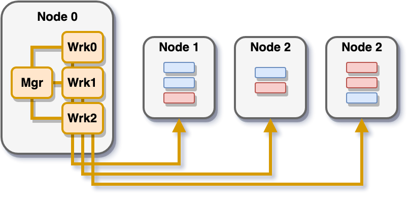

libEnsemble has been largely developed, supported, and tested on Linux
distributions and macOS. Although libEnsemble and most user functions are
cross-platform compatible, there are platform-specific differences
for installing and configuring libEnsemble.

Personal Machines
=================

Users interested in installing and running libEnsemble on their personal machines
are encouraged to read the Quickstart guide :doc:`here<../quickstart>`.

High-Powered Computing Machines
===============================

libEnsemble's worker processes can scale collections of computations across
small and large resource sets. When running at massive resource scales
on High-Powered Computing (HPC) machines, libEnsemble workers can
be distributed much more flexibly.

libEnsemble's architecture lends it best to two general modes of worker
distributions across allocated compute nodes. The first mode we refer
to as *centralized* mode, where the libEnsemble manager and worker processes
all co-exist on a single node, but through the libEnsemble job controller or a
job-launch command can execute calculations on the other allocated nodes.

Alternatively, in *distributed* mode, each worker process runs independently of
other workers directly on one or more allocated nodes.

.. image:: ../images/distributed_Bb.png
    :alt: distributed

.. note::

    Certain machines (like Theta and Summit) do not support distributed mode

.. toctree::
    :maxdepth: 2
    :titlesonly:

    bebop
    theta
