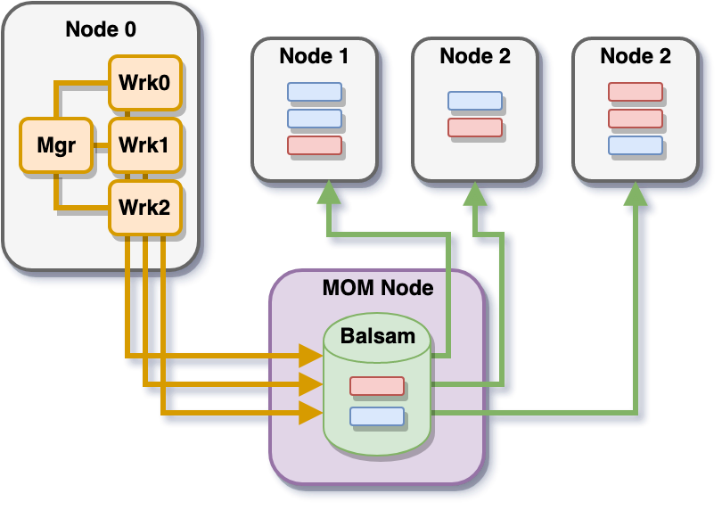

=====
Theta
=====

Theta_ is a 11.69 petaflops Cray XC40 system based on the second-generation Intel
Xeon Phi processor, available within ALCF_ at Argonne National Laboratory.

Theta features three tiers of nodes: login, MOM (Machine-Oriented Mini-server),
and compute nodes. MOM nodes execute user batch-scripts to run on the compute nodes.

Configuring Python
------------------

Begin by loading the Python 3 Miniconda_ module::

    $ module load miniconda-3.6/conda-4.5.12

Create a Conda_ virtual environment in which to install libEnsemble and all
dependencies::

    $ conda config --add channels intel
    $ conda create --name my_env intelpython3_core python=3
    $ source activate my_env

More information_ on using Conda on Theta.

Installing libEnsemble and Dependencies
---------------------------------------

libEnsemble and mpi4py
^^^^^^^^^^^^^^^^^^^^^^

There should be an indication that the virtual environment is activated.
Install mpi4py_ and libEnsemble in this environment, making sure to reference
the pre-installed Intel MPI Compiler. Your prompt should be similar to the
following block:

.. code-block:: console

    (my_env) user@thetalogin6:~$ CC=mpiicc MPICC=mpiicc pip install mpi4py --no-binary mpi4py
    (my_env) user@thetalogin6:~$ pip install libensemble

.. note::
    If you encounter pip errors, run ``python -m pip install --upgrade pip`` first

Balsam (Optional)
^^^^^^^^^^^^^^^^^

Balsam_ is an ALCF Python utility for coordinating and executing workflows of
computations on systems like Theta. Balsam can stage in tasks to a database hosted
on a MOM node and submit these tasks dynamically to the compute nodes. libEnsemble
can also be submitted to Balsam for centralized execution on a compute-node. At
this point, libEnsemble can then submit tasks to Balsam through libEnsemble's
Balsam job-controller for execution on additional allocated nodes:

Load the Balsam module with::

    $ module load balsam/0.3.5.1

Initialize a new database similarly to the following (from the Balsam docs):

.. code-block:: bash

    $ balsam init ~/libe-workflow
    $ source balsamactivate libe-workflow
    $ balsam app --name libe-app --executable "calling.py"
    $ balsam job --name libe-job --workflow test --application libe-app --args "hello!"
    $ balsam submit-launch -A [project] -q default -t 5 -n 1 --job-mode=mpi
    $ watch balsam ls   #  follow status in realtime from command-line

See **Additional Information** for Balsam's documentation.

Job Submission
--------------

Theta uses Cobalt_ for job management and submission. For libEnsemble, the most
important command is ``qsub``, for submitting batch scripts from the login nodes
to execute on the MOM nodes.

On Theta, libEnsemble's communications are commonly configured to run in one of two ways:

    1. **Multiprocessing mode**, where libEnsemble's MPI job-controller takes
    responsibility for direct submissions of jobs to compute nodes. In this mode,
    libEnsemble itself, including all manager and worker processes, runs on the
    MOM nodes.

    2. **MPI mode**, with libEnsemble's Balsam job-controller interfacing with the
    previously-mentioned Balsam backend for dynamic task submission. In this mode
    libEnsemble has been submitted to Balsam and tasked to a compute-node.

Theta features one default production queue, ``default``, and two debug queues,
``debug-cache-quad`` and ``debug-flat-quad``.

.. note::
    For the default queue, the minimum number of nodes to allocate at once is 128

Interactive Runs
^^^^^^^^^^^^^^^^

Users can run interactively with ``qsub`` by specifying the ``-I`` flag, similarly
to the following::

    $ qsub -A [project] -n 128 -q default -t 120 -I

This will place the user on a MOM node. If running in multiprocessing mode, launching
jobs to the compute nodes is as simple as ``python calling_script.py``

.. note::
    You will need to re-activate your conda virtual environment, re-activate your
    Balsam database (if using Balsam), and reload your modules! Configuring this
    routine to occur automatically is recommended.

Batch Runs
^^^^^^^^^^

Batch scripts specify run-settings using ``#COBALT`` statements. A simple example
for a libEnsemble use-case may resemble the following:

.. code-block:: bash

    #!/bin/bash -x
    #COBALT -t 02:00:00
    #COBALT -n 128
    #COBALT -q default
    #COBALT -A [project]
    #COBALT -O libE-project

    module load miniconda-3.6/conda-4.5.12

    # Name of calling script
    export EXE=calling_script.py

    # Communication Method
    export COMMS='--comms local'

    # Number of workers.
    export NWORKERS='--nworkers 128'

    # Name of Conda environment
    export CONDA_ENV_NAME=my_env

    # Activate Conda environment
    export PYTHONNOUSERSITE=1
    source activate $CONDA_ENV_NAME

    # Conda location - theta specific
    export PATH=/home/user/path/to/packages/:$PATH
    export LD_LIBRARY_PATH=/home/user/path/to/packages/:$LD_LIBRARY_PATH
    export PYTHONPATH=/home/user/path/to/env/packages:$PYTHONPATH

    # Required for python kills on Theta
    export PMI_NO_FORK=1

    python $EXE $COMMS $NWORKERS > out.txt 2>&1

With this saved as ``myscript.sh``, allocating, configuring, and running libEnsemble
on Theta becomes::

    $ qsub --mode script myscript.sh

Balsam Runs
^^^^^^^^^^^

Balsam runs are Batch runs, except Balsam is responsible for submitting libEnsemble
for execution. This is an example Balsam submission script:

.. code-block:: bash

    #!/bin/bash -x
    #COBALT -t 60
    #COBALT -O libE_test
    #COBALT -n 128
    #COBALT -q default
    ##COBALT -A [project]

    # Name of calling script
    export EXE=calling_script.py

    # Number of workers.
    export NUM_WORKERS=128

    # Wall-clock for libE job (supplied to Balsam)
    export LIBE_WALLCLOCK=45

    # Name of working directory where Balsam places running jobs/output
    export WORKFLOW_NAME=libe_workflow

    #Tell libE manager to stop workers, dump timing.dat and exit after time.
    export SCRIPT_ARGS=$(($LIBE_WALLCLOCK-3))

    # Name of Conda environment
    export CONDA_ENV_NAME=my_env

    # Conda location - theta specific
    export PATH=/path/to/python/bin:$PATH
    export LD_LIBRARY_PATH=~/path/to/conda/env/lib:$LD_LIBRARY_PATH

    #Ensure environment isolated
    export PYTHONNOUSERSITE=1

    # Required for python kills on Theta
    export PMI_NO_FORK=1

    # Activate conda environment
    . activate $CONDA_ENV_NAME

    # Activate Balsam database
    . balsamactivate default

    # Currently need at least one DB connection per worker (for postgres).
    if [[ $NUM_WORKERS -gt 128 ]]
    then
       #Add a margin
       echo -e "max_connections=$(($NUM_WORKERS+10)) #Appended by submission script" >> $BALSAM_DB_PATH/balsamdb/postgresql.conf
    fi
    wait

    # Make sure no existing apps/jobs
    balsam rm apps --all --force
    balsam rm jobs --all --force
    wait
    sleep 3

    # Add calling script to Balsam database as app and job.
    THIS_DIR=$PWD
    SCRIPT_BASENAME=${EXE%.*}

    balsam app --name $SCRIPT_BASENAME.app --exec $EXE --desc "Run $SCRIPT_BASENAME"

    # Running libE on one node - one manager and upto 63 workers
    balsam job --name job_$SCRIPT_BASENAME --workflow $WORKFLOW_NAME --application $SCRIPT_BASENAME.app --args $SCRIPT_ARGS --wall-time-minutes $LIBE_WALLCLOCK --num-nodes 1 --ranks-per-node $((NUM_WORKERS+1)) --url-out="local:/$THIS_DIR" --stage-out-files="*.out *.txt *.log" --url-in="local:/$THIS_DIR/*" --yes

    #Run job
    balsam launcher --consume-all --job-mode=mpi --num-transition-threads=1

    . balsamdeactivate

See **Additional Information** for the Balsam docs.

Debugging Strategies
--------------------

View the status of your submitted jobs with ``qstat -fu [user]``.

Theta features two debug queues with sixteen nodes apiece. Each user can allocate
up to eight nodes at once for a maximum of one hour. Allocate nodes on a debug
queue interactively::

    $ qsub -A [project] -n 4 -q debug-flat-quad -t 60 -I

Additional Information
----------------------

See the ALCF guides_ on XC40 systems for more information about Theta.

Read the documentation for Balsam here_.

.. _ALCF: https://www.alcf.anl.gov/
.. _Theta: https://www.alcf.anl.gov/theta
.. _Balsam: https://www.alcf.anl.gov/balsam
.. _Cobalt: https://www.alcf.anl.gov/cobalt-scheduler
.. _guides: https://www.alcf.anl.gov/user-guides/computational-systems
.. _here: https://balsam.readthedocs.io/en/latest/
.. _Miniconda: https://docs.conda.io/en/latest/miniconda.html
.. _Conda: https://conda.io/en/latest/
.. _information: https://www.alcf.anl.gov/user-guides/conda
.. _mpi4py: https://mpi4py.readthedocs.io/en/stable/
