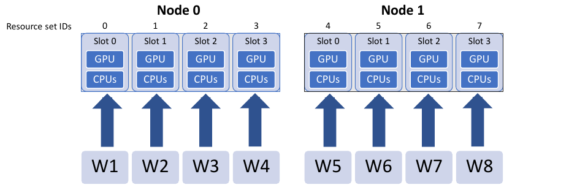
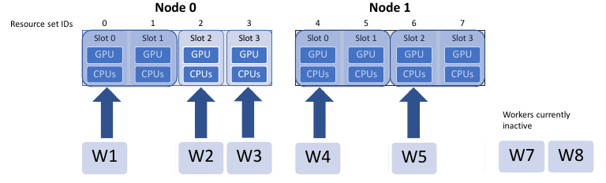
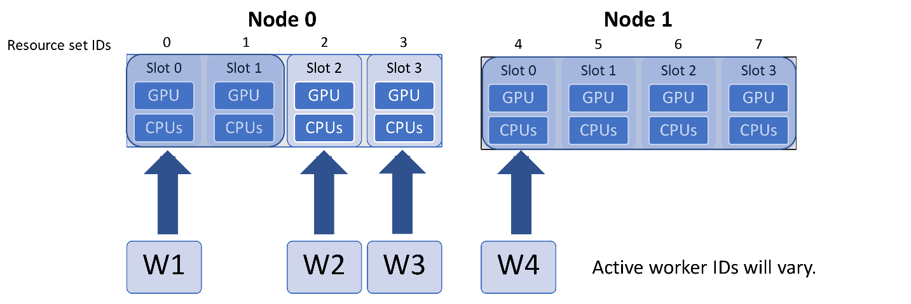
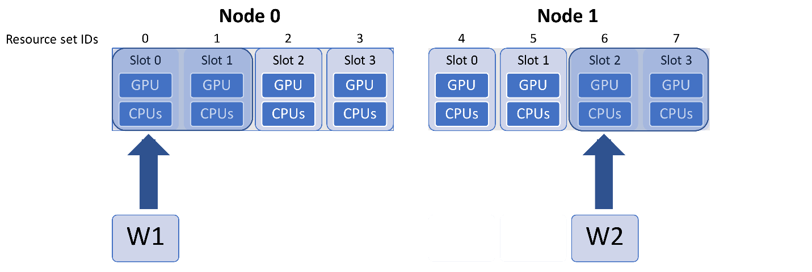
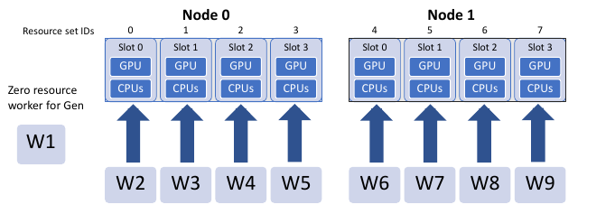
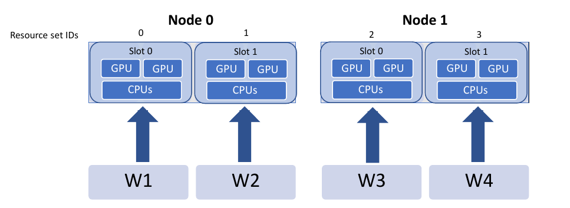
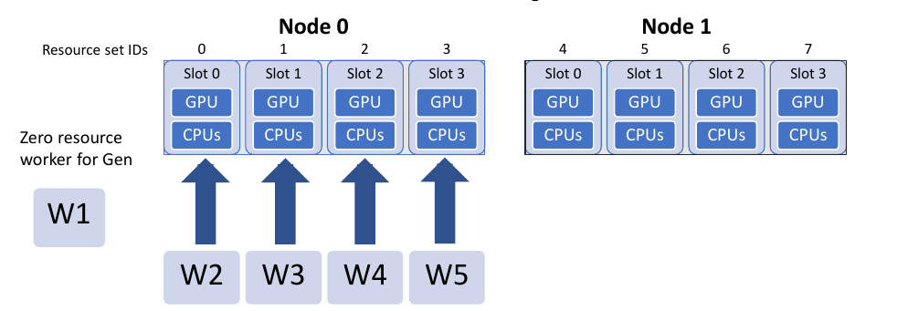

Dynamic Assignment of Resources
===============================

Overview
--------

libEnsemble comes with built-in resource management. This entails the
:ref:`detection of available resources<resource_detection>` (e.g., nodelists,
core counts, and GPUs), and the allocation of resources to workers.

By default, the provisioned resources are divided by the number of workers.
libEnsemble's :doc:`MPI Executor<../executor/mpi_executor>` is aware of
these supplied resources, and if not given any of ``num_nodes``, ``num_procs``,
or ``procs_per_node`` in the submit function, it will try to use all nodes and
CPU cores available to the worker.

Detected resources can be overridden using the ``libE_specs`` option
:ref:`resource_info<resource_info>`.

Variable resource assignment
----------------------------

.. note::
    As of **version 0.10.0**, the concept of resource sets is not needed. The generator
    can use special ``gen_specs["out"]`` fields of ``num_procs`` and ``num_gpus`` for each
    simulation generated. These will be used to assign resources and will be
    automatically passed through and used by the executor (if no other run configuration
    is given in the submit line). Furthermore, GPUs will be automatically assigned
    in the correct way for the given system (including Nvidia, AMD, and Intel GPUs);
    you do not need to set ``CUDA_VISIBLE_DEVICES`` or equivalent. Example:
    `test_GPU_variable_resources.py`_

In slightly more detail, the resource manager divides resources into **resource sets**.
One resource set is the smallest unit of resources that can be assigned (and
dynamically reassigned) to workers. By default, the provisioned resources are
divided by the number of workers (excluding any workers given in the
``zero_resource_workers`` :class:`libE_specs<libensemble.specs.LibeSpecs>` option).
However, it can also be set directly by the ``num_resource_sets``
:class:`libE_specs<libensemble.specs.LibeSpecs>` option. If the latter is set, the
dynamic resource assignment algorithm will always be used.

If there are more resource sets than nodes, then the resource sets on each node
will be given a slot number, enumerated from zero. For example, if there are three
slots on a node, they will have slot numbers 0, 1, and 2.

The resource manager will not split a resource set over nodes, rather the resource
sets on each node will be the integer division of resource sets over nodes, with
the remainder dealt out from the first node. Even breakdowns are generally
preferable, however.

For example, say a given system has four GPUs per node, and the user has run
libEnsemble on two nodes, with eight workers. The default division of resources
would be:

.. _rsets-diagram:

Variable Size simulations
^^^^^^^^^^^^^^^^^^^^^^^^^

A dynamic assignment of resources to simulation workers can be achieved by the
convention of using a field in the history array called ``resource_sets``. While
this is technically a user space field, the allocation functions are set up to
read this field, check available resources, and assign resource sets to workers,
along with the work request (simulation).

In the calling script, use a ``gen_specs["out"]`` field called ``resource_sets``:

.. code-block:: python
    :emphasize-lines: 6

    gen_specs = {
        "gen_f": gen_f,
        "in": ["sim_id"],
        "out": [
            ("priority", float),
            ("resource_sets", int),
            ("x", float, n),
        ],
    }

For an example calling script, see the regression test
`test_persistent_sampling_CUDA_variable_resources.py`_

In the generator, the ``resource_sets`` field must be set to a value for each point
(simulation) generated (if it is not set, it will have the initialized value of zero,
and supply zero resources).

.. code-block:: python
    :emphasize-lines: 4

    H_o = np.zeros(b, dtype=gen_specs["out"])
    for i in range(0, b):
        H_o["x"][i] = x[b]
        H_o["resource_sets"][i] = sim_size[b]

For an example generator, see the *uniform_sample*
function in `persistent_sampling_var_resources.py`_

When the allocation function assigns the points to workers for evaluation, it
will check if the requested number of resource sets are available for each point
to evaluate. If they are not available, then the evaluation will not be given to
a worker until enough resources become available. This functionality is built
into the supplied allocation functions and generally requires no modification
from the user.

The particular nodes and slots assigned to each worker will be determined by the
libEnsemble :doc:`built-in scheduler<scheduler_module>`, although users can provide
an alternative scheduler via the :doc:`allocation function<../function_guides/allocator>`.
In short, the scheduler will prefer fitting simulations onto a node, and using
even splits across nodes, if necessary.

Accessing resources from the simulation function
^^^^^^^^^^^^^^^^^^^^^^^^^^^^^^^^^^^^^^^^^^^^^^^^

In the user's simulation function, the resources supplied to the worker can be
:doc:`interrogated directly via the resources class attribute<worker_resources>`.
libEnsemble's executors (e.g., the :doc:`MPI Executor<../executor/mpi_executor>`) are
aware of these supplied resources, and if not given any of ``num_nodes``, ``num_procs``,
or ``procs_per_node`` in the submit function, it will try to use all nodes and CPU
cores available.

`var_resources.py`_ has two examples of how resource information for the worker may be
accessed in the sim function (*multi_points_with_variable_resources* and
*CUDA_variable_resources*).

For example, in *CUDA_variable_resources*, the environment variable
``CUDA_VISIBLE_DEVICES`` is set to slots:

.. code-block:: python
    :emphasize-lines: 2

    resources = Resources.resources.worker_resources
    resources.set_env_to_slots("CUDA_VISIBLE_DEVICES")  # Use convenience function.
    num_nodes = resources.local_node_count
    cores_per_node = resources.slot_count  # One CPU per GPU

In the figure above, this would result in worker one setting::

    export CUDA_VISIBLE_DEVICES=0,1

while worker five would set::

    export CUDA_VISIBLE_DEVICES=2,3

.. note::
    If the user sets the number of resource sets directly using the ``num_resource_sets``
    :class:`libE_specs<libensemble.specs.LibeSpecs>` option, then the dynamic resource
    assignment algorithm will always be used. If ``resource_sets`` is not a field in ``H``,
    then each worker will use one resource set.

Resource Scheduler Options
^^^^^^^^^^^^^^^^^^^^^^^^^^

The following options are available for the :doc:`built-in scheduler<scheduler_module>`
and can be set by a dictionary supplied via ``libE_specs["scheduler_opts"]``

 **split2fit** [boolean]
    Try to split resource sets across more nodes if space is not currently
    available on the minimum node count required. Allows more efficient
    scheduling.
    Default: True

 **match_slots** [boolean]:
    When splitting resource sets across multiple nodes, slot IDs must match.
    Useful if setting an environment variable such as ``CUDA_VISIBLE_DEVICES``
    to specific slot counts, which should match over multiple nodes.
    Default: True

In the following example, assume the next simulation requires **four** resource
sets. This could fit on one node if all slots were free, but only two are free on each
node.

``split2fit`` allows the two resource sets to be used on each node. However, the task
will not be scheduled unless ``match_slots`` is set to *False*:

.. code-block:: python

    libE_specs["scheduler_opts"] = {"match_slots": False}

This is only recommended if not enumerating resources to slot IDs (e.g., via ``CUDA_VISIBLE_DEVICES``).

Note that if six resource sets were requested, then they would be split three per node, even
if ``split2fit`` is *False*, as this could otherwise never be scheduled.

Varying generator resources
^^^^^^^^^^^^^^^^^^^^^^^^^^^

By default, generators are not allocated resources in dynamic mode. Fixed resources
for the generator can be set using the *libE_specs* options
``gen_num_procs`` and ``gen_num_gpus``, which take integer values.
If only ``gen_num_gpus`` is set, then the number of processors will be set to match.

To vary generator resources, ``persis_info`` settings can be used in allocation
functions before calling the ``gen_work`` support function. This takes the
same options (``gen_num_procs`` and ``gen_num_gpus``).

Alternatively, the setting ``persis_info["gen_resources"]`` can also be set to
a number of resource sets.

Note that persistent workers maintain their resources until they come out of a
persistent state.

Example scenarios
-----------------

Persistent generator
^^^^^^^^^^^^^^^^^^^^

You have *one* persistent generator and want *eight* workers to run concurrent
simulations. In this case you can run with *nine* workers.

Either explicitly set eight resource sets (recommended):

.. code-block:: python

    libE_specs["num_resource_sets"] = 8

Or if the generator should always be the same worker, use one zero-resource worker:

.. code-block:: python

    libE_specs["zero_resource_workers"] = [1]

For the second option, an allocation function supporting zero-resource workers must be used.

Using the two-node example above, the initial worker mapping in this example will be:

Using large resource sets
^^^^^^^^^^^^^^^^^^^^^^^^^

Note that resource_sets and slot numbers are based on workers by default. If you
halved the workers in this example you would have the following (each resource
set has twice the CPUs and GPUs).

To set CUDA_VISIBLE_DEVICES to slots in this case, use the  ``multiplier``
argument in the ``set_env_to_slots`` function:

.. code-block:: python
    :emphasize-lines: 2

    resources = Resources.resources.worker_resources
    resources.set_env_to_slots("CUDA_VISIBLE_DEVICES", multiplier=2)

Setting more resource sets than workers
^^^^^^^^^^^^^^^^^^^^^^^^^^^^^^^^^^^^^^^

Resource sets can be set to more than the number of corresponding workers. In this
example there are 5 workers (one for the generator) and 8 resource sets. The additional
resources will be used for larger simulations.

This could be achieved by setting:

.. code-block:: python

    libE_specs["num_resource_sets"] = 8

and running on 5 workers.

Also, this can be set on the command line as a convenience.

.. code-block:: bash

    python run_ensemble.py --nworkers 5 --nresource_sets 8

.. _persistent_sampling_var_resources.py: https://github.com/Libensemble/libensemble/blob/develop/libensemble/gen_funcs/persistent_sampling_var_resources.py
.. _test_GPU_variable_resources.py: https://github.com/Libensemble/libensemble/blob/develop/libensemble/tests/regression_tests/test_GPU_variable_resources.py
.. _test_persistent_sampling_CUDA_variable_resources.py: https://github.com/Libensemble/libensemble/blob/develop/libensemble/tests/functionality_tests/test_persistent_sampling_CUDA_variable_resources.py
.. _var_resources.py: https://github.com/Libensemble/libensemble/blob/develop/libensemble/sim_funcs/var_resources.py
