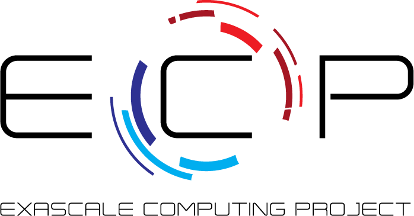
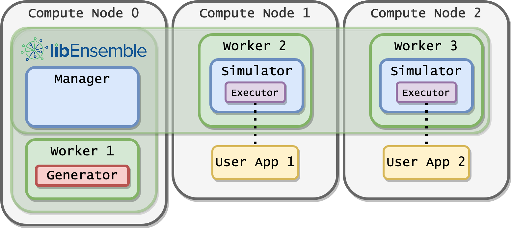
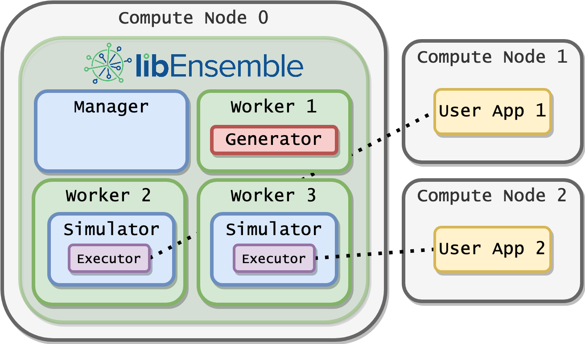
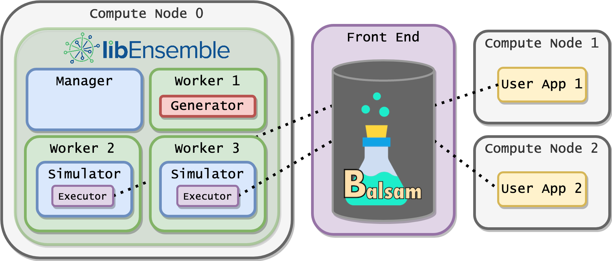

=========================================================================
**libEnsemble**: A Python Library for Dynamic Ensemble-Based Computations
=========================================================================

*David Bindel, Stephen Hudson, Jeffrey Larson, John-Luke Navarro and Stefan Wild*

A PDF poster version of this content is available on figshare_.

.. _FigShare: https://figshare.com/articles/libEnsemble_A_Python_Library_for_Dynamic_Ensemble-Based_Computations/12559520

Overview
--------

**libEnsemble** is a Python library for coordinating the concurrent evaluation of
dynamic ensembles of calculations. The library is developed to use massively
parallel resources to accelerate the solution of design, decision, and
inference problems and to expand the class of problems that can benefit from
increased concurrency levels.

libEnsemble aims for the following:

• Extreme scaling
• Resilience/fault tolerance
• Monitoring/killing of tasks (and recovering resources)
• Portability and flexibility
• Exploitation of persistent data/control flow

libEnsemble is most commonly used to coordinate large numbers of parallel
instances (ensembles) of simulations at huge scales.

Using libEnsemble
-----------------

The user selects or supplies a ``gen_f`` function  that generates simulation
input and a ``sim_f`` function that performs and monitors simulations. The user
parameterizes these functions and initiates libEnsemble in a *calling script*.
Examples and templates of such scripts and functions are included in the library.

For example, the ``gen_f`` may contain an optimization routine to generate new
simulation parameters on-the-fly based on results from previous ``sim_f``
simulations.

Other potential use-cases include:

====================             =====================
Generator Functions:             Simulation Functions:
====================             =====================
Parameter estimation             Particle-in-cell
Surrogate models                 Subsurface flow
Sensitivity analysis             PETSc simulations
Design optimization              DFT simulations
Supervised learning              Quantum chemistry
====================             =====================

Manager and Workers
-------------------

libEnsemble employs a manager/worker scheme that can communicate through **MPI**,
Python's **multiprocessing**, or **TCP**. Each *worker*
can control and monitor any level of work, from small sub-node tasks to huge
many-node simulations. The *manager* allocates workers to asynchronously execute
``gen_f`` generation functions and ``sim_f`` simulation functions based on
produced output, directed by a provided ``alloc_f`` allocation function.

Flexible Run Mechanisms
-----------------------

libEnsemble has been developed, supported, and tested on systems of highly
varying scales, from laptops to machines with thousands of compute nodes.
On multi-node systems, there are two basic modes of configuring libEnsemble to
run and launch tasks (user applications) on available nodes.

* **Distributed**: Workers are distributed across allocated nodes and launch tasks in-place. Workers share nodes with their applications.

* **Centralized**: Workers run on one or more dedicated nodes and launch tasks to the remaining allocated nodes.

.. note::
    Dividing up workers and tasks to allocated nodes is highly configurable.
    Multiple workers (and thus multiple tasks or user function instances) can be
    assigned to a single node. Alternatively, multiple nodes may be assigned to
    a single worker and each routine it performs.

Executor Module
---------------

An *Executor* interface is provided to ensure libEnsemble routines that
coordinate user applications are portable, resilient, and flexible. The Executor
automatically detects allocated nodes and available cores and can split up tasks
if resource data isn't supplied.

The Executor is agnostic of both the job launch/management system and selected
manager/worker communication method on each machine. The main functions are
``submit()``, ``poll()``, and ``kill()``.

On machines that do not support launches from compute nodes, libEnsemble's
Executor can interface with the **Balsam** library, which functions as a proxy
job launcher that maintains and submits jobs from a database on front end launch
nodes.

Supported Research Machines
---------------------------

libEnsemble is tested and supported on the following high-performance research machines:

========   =======================================================       ========     ================================================
Machine                         Location                                 Facility                        Info
========   =======================================================       ========     ================================================
Summit_    `Oak Ridge National Laboratory`_                              OLCF_        IBM AC922, IBM POWER9 nodes w/ NVIDIA Volta GPUs
Theta_     `Argonne National Laboratory`_                                ALCF_        Cray XC40, Intel KNL nodes
Cori_      `National Energy Research Scientific Computing Center`_                    Cray XC40, Intel Haswell & KNL nodes
Bridges_   `Pittsburgh Supercomputing Center`_                                        HPE, Intel Haswell nodes, NVIDIA GPU nodes
========   =======================================================       ========     ================================================

.. _Summit: https://www.olcf.ornl.gov/olcf-resources/compute-systems/summit/
.. _Theta: https://www.alcf.anl.gov/alcf-resources/theta
.. _Cori: https://docs.nersc.gov/systems/cori/
.. _Bridges: https://www.psc.edu/resources/computing/bridges

.. _`Oak Ridge National Laboratory`: https://www.ornl.gov/
.. _`Argonne National Laboratory`: https://www.anl.gov/
.. _`National Energy Research Scientific Computing Center`: https://www.nersc.gov/
.. _`Pittsburgh Supercomputing Center`: https://www.psc.edu/

.. _OLCF: https://www.olcf.ornl.gov/
.. _ALCF: https://www.alcf.anl.gov/

Running at Scale
----------------

**OPAL Simulations**

* ALCF/Theta (Cray XC40) with Balsam, at Argonne National Laboratory
* 1030 node allocation, 511 workers, MPI communications.
* 2044 2-node simulations
* Object Oriented Parallel Accelerator Library (OPAL) simulation functions.

.. list-table::

    * - .. figure:: images/libe_opal_complete_v_killed_511w_2044sims_1030nodes.png

           Histogram of completed and killed simulations, binned by run time.

    * - .. figure:: images/libe_opal_util_v_time_511w_2044sims_1030nodes.png

           Total number of Balsam-launched applications running over time.

Try libEnsemble Online
----------------------

Try libEnsemble online with two Jupyter notebook examples.

The first notebook demonstrates the basics of parallel ensemble calculations
with libEnsemble through a Simple Functions Tutorial. The second notebook, an
Executor Tutorial, contains an example similar to most use-cases: simulation
functions that launch and coordinate user applications.

.. note::
    The Executor Tutorial notebook may take a couple minutes to initiate.

.. image:: https://img.shields.io/badge/libEnsemble-Simple%20Functions%20Tutorial-579ACA.svg?logo=data:image/png;base64,iVBORw0KGgoAAAANSUhEUgAAAFkAAABZCAMAAABi1XidAAAB8lBMVEX///9XmsrmZYH1olJXmsr1olJXmsrmZYH1olJXmsr1olJXmsrmZYH1olL1olJXmsr1olJXmsrmZYH1olL1olJXmsrmZYH1olJXmsr1olL1olJXmsrmZYH1olL1olJXmsrmZYH1olL1olL0nFf1olJXmsrmZYH1olJXmsq8dZb1olJXmsrmZYH1olJXmspXmspXmsr1olL1olJXmsrmZYH1olJXmsr1olL1olJXmsrmZYH1olL1olLeaIVXmsrmZYH1olL1olL1olJXmsrmZYH1olLna31Xmsr1olJXmsr1olJXmsrmZYH1olLqoVr1olJXmsr1olJXmsrmZYH1olL1olKkfaPobXvviGabgadXmsqThKuofKHmZ4Dobnr1olJXmsr1olJXmspXmsr1olJXmsrfZ4TuhWn1olL1olJXmsqBi7X1olJXmspZmslbmMhbmsdemsVfl8ZgmsNim8Jpk8F0m7R4m7F5nLB6jbh7jbiDirOEibOGnKaMhq+PnaCVg6qWg6qegKaff6WhnpKofKGtnomxeZy3noG6dZi+n3vCcpPDcpPGn3bLb4/Mb47UbIrVa4rYoGjdaIbeaIXhoWHmZYHobXvpcHjqdHXreHLroVrsfG/uhGnuh2bwj2Hxk17yl1vzmljzm1j0nlX1olL3AJXWAAAAbXRSTlMAEBAQHx8gICAuLjAwMDw9PUBAQEpQUFBXV1hgYGBkcHBwcXl8gICAgoiIkJCQlJicnJ2goKCmqK+wsLC4usDAwMjP0NDQ1NbW3Nzg4ODi5+3v8PDw8/T09PX29vb39/f5+fr7+/z8/Pz9/v7+zczCxgAABC5JREFUeAHN1ul3k0UUBvCb1CTVpmpaitAGSLSpSuKCLWpbTKNJFGlcSMAFF63iUmRccNG6gLbuxkXU66JAUef/9LSpmXnyLr3T5AO/rzl5zj137p136BISy44fKJXuGN/d19PUfYeO67Znqtf2KH33Id1psXoFdW30sPZ1sMvs2D060AHqws4FHeJojLZqnw53cmfvg+XR8mC0OEjuxrXEkX5ydeVJLVIlV0e10PXk5k7dYeHu7Cj1j+49uKg7uLU61tGLw1lq27ugQYlclHC4bgv7VQ+TAyj5Zc/UjsPvs1sd5cWryWObtvWT2EPa4rtnWW3JkpjggEpbOsPr7F7EyNewtpBIslA7p43HCsnwooXTEc3UmPmCNn5lrqTJxy6nRmcavGZVt/3Da2pD5NHvsOHJCrdc1G2r3DITpU7yic7w/7Rxnjc0kt5GC4djiv2Sz3Fb2iEZg41/ddsFDoyuYrIkmFehz0HR2thPgQqMyQYb2OtB0WxsZ3BeG3+wpRb1vzl2UYBog8FfGhttFKjtAclnZYrRo9ryG9uG/FZQU4AEg8ZE9LjGMzTmqKXPLnlWVnIlQQTvxJf8ip7VgjZjyVPrjw1te5otM7RmP7xm+sK2Gv9I8Gi++BRbEkR9EBw8zRUcKxwp73xkaLiqQb+kGduJTNHG72zcW9LoJgqQxpP3/Tj//c3yB0tqzaml05/+orHLksVO+95kX7/7qgJvnjlrfr2Ggsyx0eoy9uPzN5SPd86aXggOsEKW2Prz7du3VID3/tzs/sSRs2w7ovVHKtjrX2pd7ZMlTxAYfBAL9jiDwfLkq55Tm7ifhMlTGPyCAs7RFRhn47JnlcB9RM5T97ASuZXIcVNuUDIndpDbdsfrqsOppeXl5Y+XVKdjFCTh+zGaVuj0d9zy05PPK3QzBamxdwtTCrzyg/2Rvf2EstUjordGwa/kx9mSJLr8mLLtCW8HHGJc2R5hS219IiF6PnTusOqcMl57gm0Z8kanKMAQg0qSyuZfn7zItsbGyO9QlnxY0eCuD1XL2ys/MsrQhltE7Ug0uFOzufJFE2PxBo/YAx8XPPdDwWN0MrDRYIZF0mSMKCNHgaIVFoBbNoLJ7tEQDKxGF0kcLQimojCZopv0OkNOyWCCg9XMVAi7ARJzQdM2QUh0gmBozjc3Skg6dSBRqDGYSUOu66Zg+I2fNZs/M3/f/Grl/XnyF1Gw3VKCez0PN5IUfFLqvgUN4C0qNqYs5YhPL+aVZYDE4IpUk57oSFnJm4FyCqqOE0jhY2SMyLFoo56zyo6becOS5UVDdj7Vih0zp+tcMhwRpBeLyqtIjlJKAIZSbI8SGSF3k0pA3mR5tHuwPFoa7N7reoq2bqCsAk1HqCu5uvI1n6JuRXI+S1Mco54YmYTwcn6Aeic+kssXi8XpXC4V3t7/ADuTNKaQJdScAAAAAElFTkSuQmCC
   :target: https://mybinder.org/v2/gh/Libensemble/libensemble/develop?filepath=examples%2Ftutorials%2Fsine_tutorial_notebook.ipynb

.. image:: https://img.shields.io/badge/libEnsemble-Executor%20Tutorial-E66581.svg?logo=data:image/png;base64,iVBORw0KGgoAAAANSUhEUgAAAFkAAABZCAMAAABi1XidAAAB8lBMVEX///9XmsrmZYH1olJXmsr1olJXmsrmZYH1olJXmsr1olJXmsrmZYH1olL1olJXmsr1olJXmsrmZYH1olL1olJXmsrmZYH1olJXmsr1olL1olJXmsrmZYH1olL1olJXmsrmZYH1olL1olL0nFf1olJXmsrmZYH1olJXmsq8dZb1olJXmsrmZYH1olJXmspXmspXmsr1olL1olJXmsrmZYH1olJXmsr1olL1olJXmsrmZYH1olL1olLeaIVXmsrmZYH1olL1olL1olJXmsrmZYH1olLna31Xmsr1olJXmsr1olJXmsrmZYH1olLqoVr1olJXmsr1olJXmsrmZYH1olL1olKkfaPobXvviGabgadXmsqThKuofKHmZ4Dobnr1olJXmsr1olJXmspXmsr1olJXmsrfZ4TuhWn1olL1olJXmsqBi7X1olJXmspZmslbmMhbmsdemsVfl8ZgmsNim8Jpk8F0m7R4m7F5nLB6jbh7jbiDirOEibOGnKaMhq+PnaCVg6qWg6qegKaff6WhnpKofKGtnomxeZy3noG6dZi+n3vCcpPDcpPGn3bLb4/Mb47UbIrVa4rYoGjdaIbeaIXhoWHmZYHobXvpcHjqdHXreHLroVrsfG/uhGnuh2bwj2Hxk17yl1vzmljzm1j0nlX1olL3AJXWAAAAbXRSTlMAEBAQHx8gICAuLjAwMDw9PUBAQEpQUFBXV1hgYGBkcHBwcXl8gICAgoiIkJCQlJicnJ2goKCmqK+wsLC4usDAwMjP0NDQ1NbW3Nzg4ODi5+3v8PDw8/T09PX29vb39/f5+fr7+/z8/Pz9/v7+zczCxgAABC5JREFUeAHN1ul3k0UUBvCb1CTVpmpaitAGSLSpSuKCLWpbTKNJFGlcSMAFF63iUmRccNG6gLbuxkXU66JAUef/9LSpmXnyLr3T5AO/rzl5zj137p136BISy44fKJXuGN/d19PUfYeO67Znqtf2KH33Id1psXoFdW30sPZ1sMvs2D060AHqws4FHeJojLZqnw53cmfvg+XR8mC0OEjuxrXEkX5ydeVJLVIlV0e10PXk5k7dYeHu7Cj1j+49uKg7uLU61tGLw1lq27ugQYlclHC4bgv7VQ+TAyj5Zc/UjsPvs1sd5cWryWObtvWT2EPa4rtnWW3JkpjggEpbOsPr7F7EyNewtpBIslA7p43HCsnwooXTEc3UmPmCNn5lrqTJxy6nRmcavGZVt/3Da2pD5NHvsOHJCrdc1G2r3DITpU7yic7w/7Rxnjc0kt5GC4djiv2Sz3Fb2iEZg41/ddsFDoyuYrIkmFehz0HR2thPgQqMyQYb2OtB0WxsZ3BeG3+wpRb1vzl2UYBog8FfGhttFKjtAclnZYrRo9ryG9uG/FZQU4AEg8ZE9LjGMzTmqKXPLnlWVnIlQQTvxJf8ip7VgjZjyVPrjw1te5otM7RmP7xm+sK2Gv9I8Gi++BRbEkR9EBw8zRUcKxwp73xkaLiqQb+kGduJTNHG72zcW9LoJgqQxpP3/Tj//c3yB0tqzaml05/+orHLksVO+95kX7/7qgJvnjlrfr2Ggsyx0eoy9uPzN5SPd86aXggOsEKW2Prz7du3VID3/tzs/sSRs2w7ovVHKtjrX2pd7ZMlTxAYfBAL9jiDwfLkq55Tm7ifhMlTGPyCAs7RFRhn47JnlcB9RM5T97ASuZXIcVNuUDIndpDbdsfrqsOppeXl5Y+XVKdjFCTh+zGaVuj0d9zy05PPK3QzBamxdwtTCrzyg/2Rvf2EstUjordGwa/kx9mSJLr8mLLtCW8HHGJc2R5hS219IiF6PnTusOqcMl57gm0Z8kanKMAQg0qSyuZfn7zItsbGyO9QlnxY0eCuD1XL2ys/MsrQhltE7Ug0uFOzufJFE2PxBo/YAx8XPPdDwWN0MrDRYIZF0mSMKCNHgaIVFoBbNoLJ7tEQDKxGF0kcLQimojCZopv0OkNOyWCCg9XMVAi7ARJzQdM2QUh0gmBozjc3Skg6dSBRqDGYSUOu66Zg+I2fNZs/M3/f/Grl/XnyF1Gw3VKCez0PN5IUfFLqvgUN4C0qNqYs5YhPL+aVZYDE4IpUk57oSFnJm4FyCqqOE0jhY2SMyLFoo56zyo6becOS5UVDdj7Vih0zp+tcMhwRpBeLyqtIjlJKAIZSbI8SGSF3k0pA3mR5tHuwPFoa7N7reoq2bqCsAk1HqCu5uvI1n6JuRXI+S1Mco54YmYTwcn6Aeic+kssXi8XpXC4V3t7/ADuTNKaQJdScAAAAAElFTkSuQmCC
  :target: https://mybinder.org/v2/gh/Libensemble/libensemble/develop?filepath=examples%2Ftutorials%2Fforces_tutorial_notebook.ipynb
