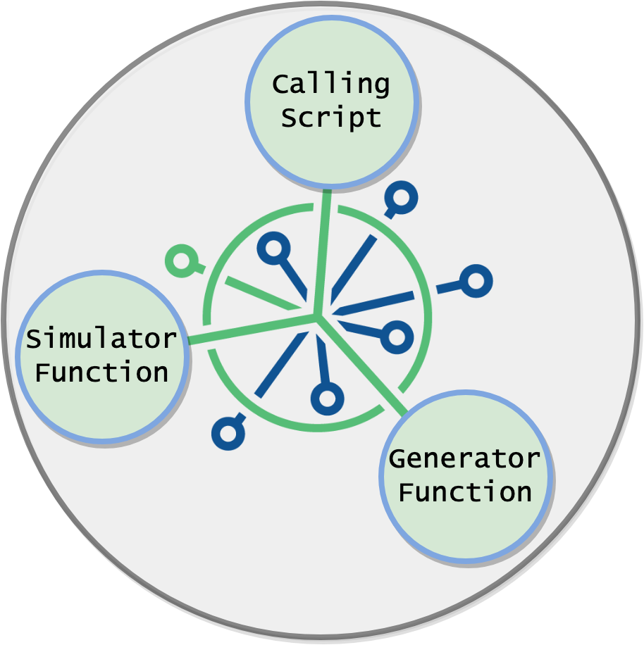
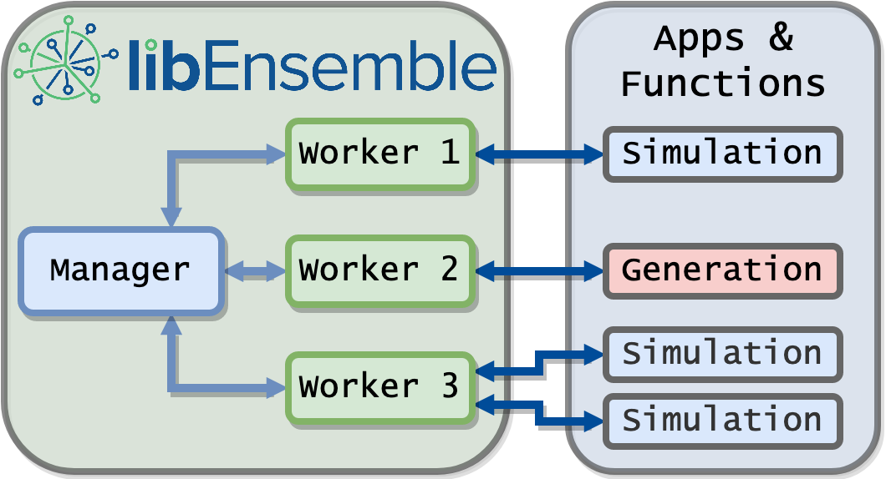
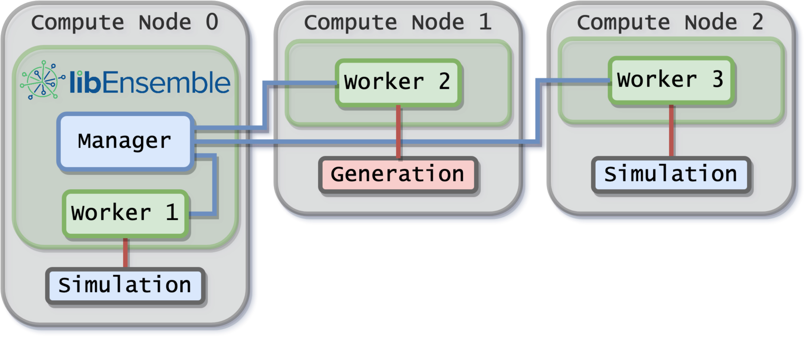
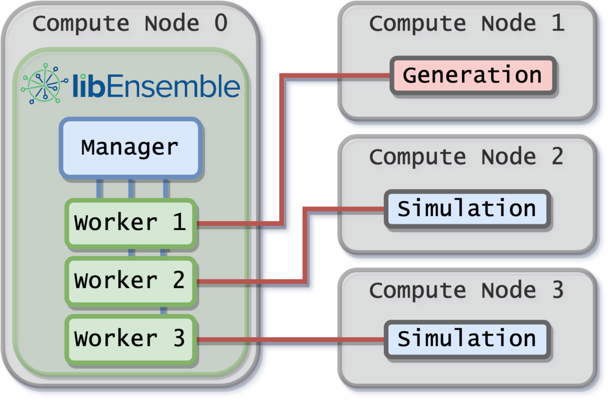
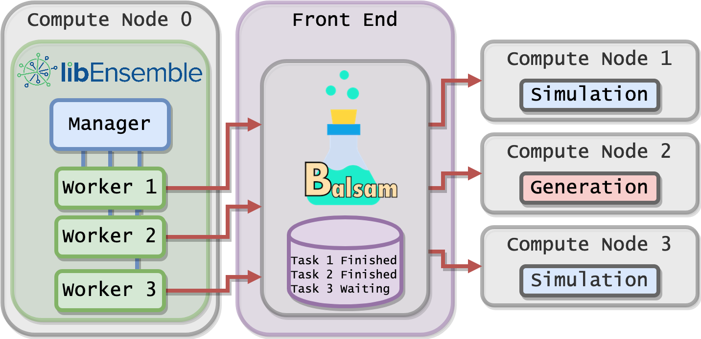

.. image:: images/ANL_CMYK.png
 :alt: ANL
 :width: 33 %
 :align: left

.. image:: images/ECP_logo.png
 :alt: ECP
 :width: 20 %
 :align: right

.. image:: images/libE_logo.png
 :alt: libEnsemble
 :align: center

A Python Library for Dynamic Ensemble-Based Computations
========================================================

*David Bindel, Stephen Hudson, Jeffrey Larson, John-Luke Navarro and Stefan Wild*

Overview
--------

libEnsemble is a Python library for coordinating the concurrent evaluation of
dynamic ensembles of calculations. The library is developed to use massively
parallel resources to accelerate the solution of design, decision, and
inference problems and to expand the class of problems that can benefit from
increased concurrency levels.

libEnsemble aims for the following:

• Extreme scaling
• Resilience/fault tolerance
• Monitoring/killing of tasks (and recovering resources)
• Portability and flexibility
• Exploitation of persistent data/control flow

libEnsemble is most commonly used to coordinate large numbers of parallel
instances (ensembles) of simulations at huge scales.

Using libEnsemble
-----------------

The user selects or supplies a ``gen_f`` function  that generates simulation
input and a ``sim_f`` function that performs and monitors simulations. The user
parameterizes these functions and initiates libEnsemble in a *calling script*.
Examples and templates of such scripts and functions are included in the library.

For example, the ``gen_f`` may contain an optimization routine to generate new
simulation parameters on-the-fly based on results from previous ``sim_f``
simulations.

Manager and Workers
-------------------

libEnsemble employs a manager/worker scheme that can communicate through various
methods like MPI, Python's multiprocessing, and TCP. Each *worker*
can control and monitor any level of work, from small sub-node tasks to huge
many-node simulations. The *manager* directs workers asynchronously to execute
``gen_f`` generation functions and ``sim_f`` simulation functions based on
available parameters, resources, or a provided ``alloc_f`` allocation function.

Flexible Run Mechanisms
-----------------------

libEnsemble has been developed, supported, and tested on systems of highly
varying scales, from laptops to machines with thousands of compute nodes.
On multi-node systems, there are two basic modes of configuring libEnsemble to
run and launch tasks (user applications) on available nodes.

* **Distributed**: Workers are distributed across allocated nodes and launch tasks in-place. Worker processes share nodes with the applications they launch.

* **Centralized**: Workers run on one or more dedicated nodes and launch tasks to the remaining allocated nodes.

Executor Module
---------------

An *executor* interface is provided to ensure libEnsemble routines that coordinate
user applications are portable, resilient, and flexible. The executor
automatically detects allocated nodes and available cores and can split up tasks
if resource data isn't supplied.

The executor is agnostic of both the job launch/management system and selected
manager/worker communication method on each machine. The main functions are
``submit()``, ``poll()``, and ``kill()``.

libEnsemble's executor can interface with the **Balsam** library, which functions
as a proxy job launcher that maintains and submits jobs from a database on
front-end nodes.

