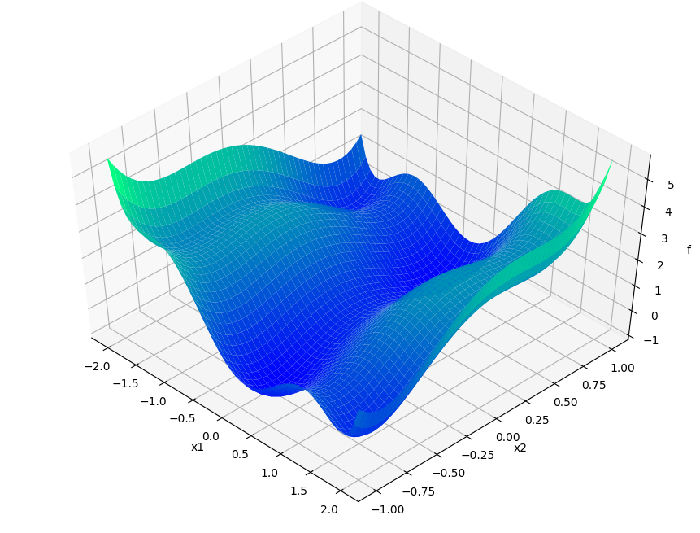
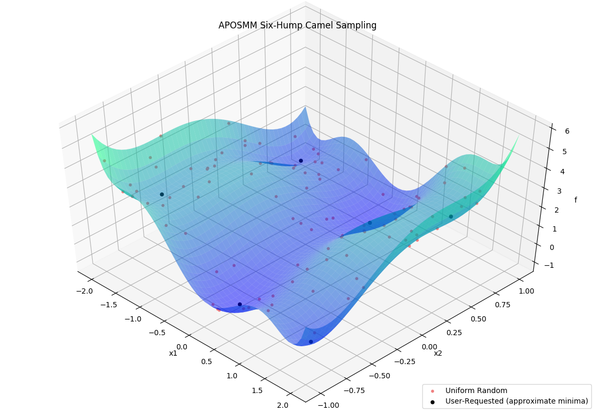

=================================
Parallel Optimization with APOSMM
=================================

This tutorial demonstrates libEnsemble's capability to identify multiple minima
of simulation output using the built-in :doc:`APOSMM<../examples/aposmm>`
(Asynchronously Parallel Optimization Solver for finding Multiple Minima)
``gen_f``. In this tutorial, we'll create a simple simulation ``sim_f`` that
defines a function with multiple minima, then write a libEnsemble calling script
that imports APOSMM and parameterizes it to check for minima over a domain of
outputs from our ``sim_f``.

Six-Hump Camel Simulation Function
----------------------------------

Describing APOSMM's operations is simpler with a given function on which to
depict evaluations. We'll use the `Six-Hump Camel function`_, known to have six
global minima. A sample space of this function, containing all minima, appears
below:

Create a new Python file named ``six_hump_camel.py``. This will be our ``sim_f``,
incorporating the above function. Write the following:

.. code-block:: python
    :linenos:

    import numpy as np

    def six_hump_camel(H, persis_info, sim_specs, _):
        """Six-Hump Camel sim_f."""

        batch = len(H['x'])  # Number of evaluations each sim_f call.
        H_o = np.zeros(batch, dtype=sim_specs['out'])  # Define output array

        for i, x in enumerate(H['x']):
            H_o['f'][i] = three_hump_camel_func(x)  # Function evaluations placed into array

        return H_o, persis_info

    def six_hump_camel_func(x):
        """ Six-Hump Camel function definition """
        x1 = x[0]
        x2 = x[1]
        term1 = (4-2.1*x1**2+(x1**4)/3) * x1**2
        term2 = x1*x2
        term3 = (-4+4*x2**2) * x2**2

        return term1 + term2 + term3

APOSMM Operations
-----------------

APOSMM coordinates multiple local optimization runs starting from a collection
of sample points. These local optimization runs occur in parallel,
and can incorporate a variety of optimization methods, including from NLopt_,
`PETSc/TAO`_, and SciPy_. Some number of uniformly sampled points is returned
by APOSMM for simulation evaluations before local optimization runs can occur,
if no prior simulation evaluations are provided. User-requested sample points
can also be provided to APOSMM:

Specifically, APOSMM will begin local optimization runs from those points that
don't have better (more minimal) points nearby within a threshold. For the above
example, after APOSMM has returned the uniformly sampled points, for simulation
evaluations it will likely begin local optimization runs from the user-requested
approximate minima. Providing these isn't required.

APOSMM Persistence
------------------

The most supported version of APOSMM included with libEnsemble is
referred to as Persistent APOSMM. Unlike other user functions that are
initiated and completed by workers multiple times based on allocation,
a single worker process initiates APOSMM so that it "persists"
and keeps running over the course of the entire libEnsemble routine. APOSMM
begins it's own parallel evaluations and communicates points back and forth with
the manager, then to workers and evaluated by simulation routines.

In practice, since a single worker becomes "persistent" for APOSMM, users must
ensure that enough workers or MPI ranks are initiated to
support libEnsemble's manager, a persistent worker to run APOSMM, and
simulation routines. The following::

    mpiexec -n 3 python my_aposmm_routine.py

will result in only one worker process available to perform simulation
routines.

.. _`Six-Hump Camel function`: https://www.sfu.ca/~ssurjano/camel6.html
.. _NLopt: https://nlopt.readthedocs.io/en/latest/
.. _`PETSc/TAO`: https://www.mcs.anl.gov/petsc/
.. _SciPy: https://www.scipy.org/scipylib/index.html
