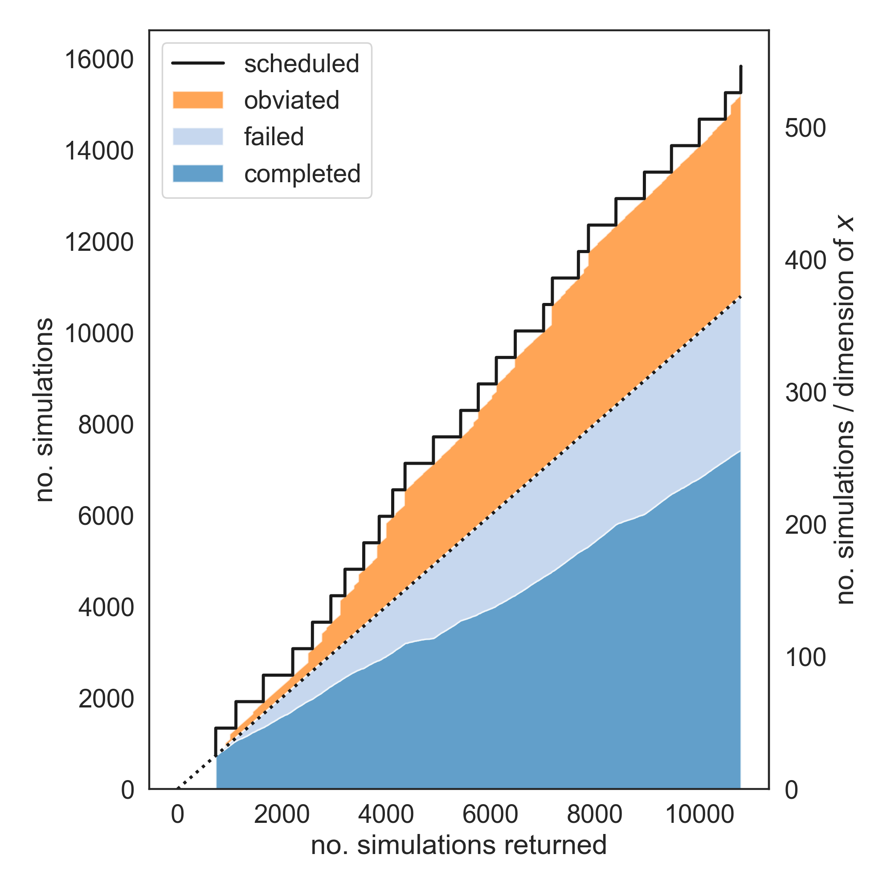

===========================================================
Borehole Calibration with Selective Simulation Cancellation
===========================================================

Introduction - Calibration with libEnsemble and a Regression Model
------------------------------------------------------------------

This tutorial demonstrates libEnsemble's capability to selectively cancel pending
simulations based on instructions from a calibration generator function.
This capability is desirable, especially when evaluations are expensive, since
compute resources may then be more effectively applied towards critical evaluations.

For a somewhat different approach than libEnsemble's :doc:`other tutorials<tutorials>`,
we'll emphasize the settings, functions, and data fields within the calling script, simple regression
:ref:`persistent generator<persistent-gens>`, Manager, and :ref:`sim_f<api_sim_f>`
that make this capability possible, rather than outlining a step-by-step process
for writing this exact use-case.

Generator - Overview of the Calibration Problem
-----------------------------------------------

The generator function featured in this tutorial can be found in
``gen_funcs/persistent_cwp_calib.py``. This version uses simplified standalone
routines in place of an in-development calibration-emulation library. Note that
this ``gen_f`` is swappable with any other ``gen_f`` that can instruct cancellation
based on received evaluations.

Given "observed values" at a given set of points called "x"s, the simple regression
generator seeks to fit a regression model to these points using a function parameterized
with "Thetas". The purpose is to find a set of Thetas that closely matches observed
values, given the uncertainty in observations. Specifically, the purpose is to sample
from the posterior distribution of Thetas.

After an initial batch of randomly sampled values, the model generates
new Thetas, such that by performing ``sim_f`` evaluations at these new Thetas the model gains
information about how the model function behaves and if certain Thetas are more likely to be
sampled from the posterior or not. Intuitively, the model generates Thetas at parameters where
there is a lack of information, e.g. where predictive variance is high:

.. math::

    \newcommand{\T}{\mathsf{T}}
    Y = \begin{pmatrix}    f(\theta_1)^\T \\ \vdots \\ f(\theta_n)^\T    \end{pmatrix} = \begin{pmatrix} f(\theta_1, x_1) & \ldots & f(\theta_1, x_m) \\ \vdots & \ddots & \vdots \\ f(\theta_n, x_1) & \ldots & f(\theta_n, x_m) \end{pmatrix}

In the above matrix, ``Y`` is a matrix of ``sim_f`` evaluations of ``(Theta, x)``
pairs, and forms the basis for building the regression model within the ``gen_f``.
Such evaluations are performed until some error threshold is reached, at which
point the generator exits and returns, initiating the shutdown of the libEnsemble routine.

The following is a pseudocode overview of the generator. Functions directly from
the calibration library used within the generator function have the ``calib: `` prefix.
Helper functions defined to improve the data received by the calibration library by
interfacing with libEnsemble have the ``libE: `` prefix. All other statements are
workflow logic or persistent generator helper functions like ``send`` or ``receive``::

    1    libE: calculate test values and first batch
    2    while STOP_signal not received:
    3        receive: evaluated points
    4        unpack points into 2D Theta x Point structures
    5        if new model condition:
    6            calib: construct new model
    7        else:
    8            wait to receive more points
    9        if data_status condition:
    10           calib: generate new rows of points from model
    11           calib: if error threshold reached:
    12               exit loop - done
    13           send: new rows of points to be evaluated
    14       if any sent points must be obviated:
    15           libE: mark points with cancel request
    16               send: points with cancel request

Generator - Point Cancellation Requests and Dedicated Fields
------------------------------------------------------------

While the generator loops and updates the model based on returned
points from simulations, it detects using a library function if any pending points
and Thetas distributed for simulation are no longer needed for the model
and ought to be cancelled (obviated). The generator then calls ``cancel_rows()``::

    r_obviate = obviate_pend_thetas(model, theta, data_status)
    if r_obviate[0].shape[0] > 0:
        cancel_rows(pre_count, r_obviate, n_x, data_status, comm)

``pre_count`` is a scalar of the number of ``sim_id``s, ``r_obviate`` is a selection
of rows to cancel, ``n_x`` is the number of ``x`` values, ``data_status`` describes
the calculation status of each point, and ``comm`` is a communicator object from
:doc:`libE_info<../data_structures/work_dict>` used to send and receive messages from the Manager.

Within ``cancel_rows()``, each row in ``r_obviate`` is iterated over, and if a
point's ``data_status`` indicates it has not yet been evaluated by a simulation,
it's ``sim_id`` is appended to a list to be sent to the Manager for cancellation.
A new, separate local :doc:`History array<../history_output>` is defined with the
selected ``'sim_id'`` s and the ``'cancel_requested'`` field set to ``True``. This array is
then sent to the Manager using the ``send_mgr_worker_msg`` persistent generator
helper function. Each of these helper functions is described :ref:`here<p_gen_routines>`.
The entire ``cancel_row()`` routine is listed below::

    def cancel_rows(pre_count, r, n_x, data_status, comm):
        # Cancel rest of row
        sim_ids_to_cancel = []
        rows = np.unique(r)
        for r in rows:
            row_offset = r*n_x
            for i in range(n_x):
                sim_id_cancl = pre_count + row_offset + i
                if data_status[r, i] == 0:
                    sim_ids_to_cancel.append(sim_id_cancl)
                    data_status[r, i] = -2

        # Send only these fields to existing H row and it will slot in change.
        H_o = np.zeros(len(sim_ids_to_cancel), dtype=[('sim_id', int), ('cancel_requested', bool)])
        H_o['sim_id'] = sim_ids_to_cancel
        H_o['cancel_requested'] = True
        send_mgr_worker_msg(comm, H_o)

Most Workers, including those running other persistent generators, are only
allocated work when they're in an :doc:`idle or non-active state<../data_structures/worker_array>`.
However, since this generator must asynchronously update its model and
cancel pending evaluations, the Worker running this generator remains
in an *active receive* state, until it becomes non-persistent. This means
both the Manager and persistent Worker must be prepared for irregular sending /
receiving of data.

Manager - Cancellation, History Updates, and Allocation
-------------------------------------------------------

Between routines to call the allocation function and distribute allocated work
to each Worker, the Manager selects points from the History array that are:

    1) Marked as ``'given'`` by the allocation function
    2) Marked with ``'cancel_requested'`` by the generator
    3) *Not* been marked as ``'returned'`` by the Manager
    4) *Not* been marked with ``'kill_sent'`` by the Manager

If any points match these characteristics, the Workers that are processing these
points are sent ``STOP`` tags and a kill signal. ``'kill_sent'``
is set to ``True`` for each of these points in the Manager's History array. During
the subsequent :ref:`start_only_persistent<start_only_persistent_label>` allocation
function calls, any points in the Manager's History array that have ``'cancel_requested'``
as ``True`` are not allocated::

    task_avail = ~H['given'] & ~H['cancel_requested']

This ``alloc_f`` also can prioritize allocating points that have
higher ``'priority'`` values from the ``gen_f`` values in the local History array::

    # Loop through available simulation workers
    for i in avail_worker_ids(W, persistent=False):

        if np.any(task_avail):
            if 'priority' in H.dtype.fields:
                priorities = H['priority'][task_avail]
                if gen_specs['user'].get('give_all_with_same_priority'):
                    indexes = (priorities == np.max(priorities))
                else:
                    indexes = np.argmax(priorities)
            else:
                indexes = 0

Simulator - Receiving Kill Signal and Cancelling Tasks
------------------------------------------------------

Within currently running simulation functions, the :doc:`Executor<../executor/overview>`
has been used to launch simulations based on points from the simple regression generator,
and has entered a routine to loop and check for signals from the Manager::

    H_o = np.zeros(H.shape[0], dtype=sim_specs['out'])
    H_o['f'] = borehole_func(H)  # Delay happens within borehole_func

    if check_for_man_kills:
        calc_status = check_for_kill_recv(sim_specs, libE_info)

The contents of ``check_for_kill_recv()`` resemble::

    exctr = Executor.executor
    start_time = time.time()
    while time.time() - start_time < timeout_time:
        time.sleep(poll_interval)
        exctr.manager_poll()
        if exctr.manager_signal == 'kill':
            exctr.kill(task)
            calc_status = MAN_SIGNAL_KILL
            break

    return calc_status

The loop periodically sleeps, then polls for signals from the Manager using
the :ref:`executor.manager_poll()<manager_poll_label>` function. Notice that
immediately after ``exctr.manager_signal`` is confirmed as ``'kill'``, the current
task launched by the Executor is killed and the function returns with the
``MAN_SIGNAL_KILL`` :doc:`calc_status<../data_structures/calc_status>`.
This status will be logged in ``libE_stats.txt``.

Calling Script - Reading Results
--------------------------------

Within the libEnsemble calling script, once the main :doc:`libE()<../libe_module>`
function call has returned, it's a simple enough process to view the History rows
that were either marked as cancelled and/or had a kill signal sent to their
associated simulation instances during the run::

    H, persis_info, flag = libE(sim_specs, gen_specs,
                                exit_criteria, persis_info,
                                alloc_specs=alloc_specs,
                                libE_specs=libE_specs)

    if is_master:
        print('Cancelled sims', H[H['cancel_requested']])
        print('Killed sims', H[H['kill_sent']])

Here's an example graph showing the relationship between scheduled, cancelled (obviated),
failed, and completed simulations requested by the ``gen_f``. Notice that for each
batch of scheduled simulations, most either complete or fail but the rest are
successfully obviated:

Please see the ``test_cwp_calib.py`` regression test for an example
routine using the simple regression calibration generator.
The associated simulation function and allocation function are included in
``sim_funcs/cwpsim.py`` and ``alloc_funcs/start_only_persistent.py`` respectively.
