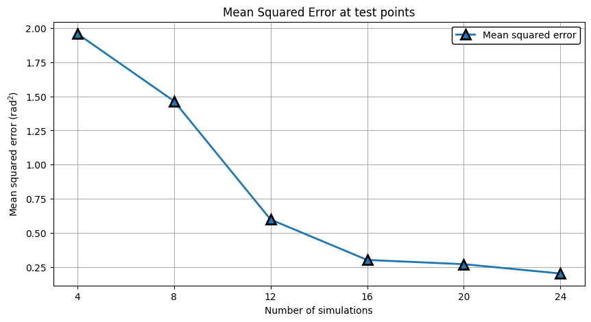

Surrogate Modeling with gpCAM
=============================

This example uses gpCAM_ to construct a global surrogate of ``f`` values using a Gaussian process.

In each iteration, a batch of points is produced for concurrent evaluation, maximizing uncertainty reduction.

|Open in Colab|

Ensure that libEnsemble, and gpCAM are installed via: ``pip install libensemble gpcam``

Generator function
------------------

The gpCAM generator function is called ``persistent_gpCAM``.

This persistent generator is started at the beginning of the Ensemble and runs until the Ensemble closes down.

This version (and others) of the gpCAM generator can be found at `libensemble/gen_funcs/persistent_gpCAM.py <https://github.com/Libensemble/libensemble/blob/main/libensemble/gen_funcs/persistent_gpCAM.py>`_ and can be imported from that location when libEnsemble is installed as follows:

``from libensemble.gen_funcs.persistent_gpCAM import persistent_gpCAM``

.. code-block:: python

    import numpy as np
    from numpy.lib.recfunctions import repack_fields
    from gpcam import GPOptimizer as GP

    # Standard options for manager/generator comms
    from libensemble.message_numbers import EVAL_GEN_TAG, FINISHED_PERSISTENT_GEN_TAG, PERSIS_STOP, STOP_TAG
    from libensemble.tools.persistent_support import PersistentSupport

    def persistent_gpCAM(H_in, persis_info, gen_specs, libE_info):
        """Run a batched gpCAM model to create a surrogate"""

        # Initialize
        rng, batch_size, n, lb, ub, x_new, y_new, ps = _initialize_gpcAM(gen_specs["user"], libE_info)
        ask_max_iter = gen_specs["user"].get("ask_max_iter") or 10
        test_points = _read_testpoints(gen_specs["user"])
        noise = 1e-8  # Initializes noise
        my_gp = None

        # Start with a batch of random points
        x_new = rng.uniform(lb, ub, (batch_size, n))
        H_o = np.zeros(batch_size, dtype=gen_specs["out"])
        H_o["x"] = x_new
        tag, Work, calc_in = ps.send_recv(H_o)  # Send random points for evaluation and wait for results

        while tag not in [STOP_TAG, PERSIS_STOP]:
            y_new = np.atleast_2d(calc_in["f"]).T
            my_gp = _update_gp(my_gp, x_new, y_new, test_points, persis_info, noise)

            # Request new points
            x_new = my_gp.ask(
                input_set=np.column_stack((lb, ub)),
                n=batch_size,
                pop_size=batch_size,
                acquisition_function="total correlation",
                max_iter=ask_max_iter,  # Larger takes longer. gpCAM default is 20.
            )["x"]

            H_o = np.zeros(batch_size, dtype=gen_specs["out"])
            H_o["x"] = x_new
            tag, Work, calc_in = ps.send_recv(H_o)  # Send points for evaluation and wait for results

        # If final points were returned update the model
        if calc_in is not None:
            y_new = np.atleast_2d(calc_in["f"]).T
            my_gp = _update_gp(my_gp, x_new, y_new, test_points, persis_info, noise)

        return None, persis_info, FINISHED_PERSISTENT_GEN_TAG

Common acquisition functions include:

**Uncertainty reduction:**

- **"variance"** (default): The optimizer will produce N best points.
- **"total correlation"**: More expensive but points produced are self-avoiding.

**Bayesian optimization:**

These produce one point at a time unless using the `HGDL <https://ieeexplore.ieee.org/abstract/document/9652812>`_ option.

- **"ucb" / "lcb"**: Upper/Lower Confidence Bound.
- **"expected improvement"**: Expected Improvement.

For more options see: https://gpcam.lbl.gov/examples/acquisition-functions

----

The following code adds the functions used by ``persistent_gpCAM``.

``_update_gp`` is where the GP is fed the data and trained.

.. code-block:: python

    def _initialize_gpcAM(user_specs, libE_info):
        """Extract user params"""
        rng_seed = user_specs.get("rng_seed")  # will default to None
        rng = np.random.default_rng(rng_seed)  # Create random stream
        b = user_specs["batch_size"]
        lb = np.array(user_specs["lb"])
        ub = np.array(user_specs["ub"])
        n = len(lb)  # no. of dimensions
        init_x = np.empty((0, n))
        init_y = np.empty((0, 1))
        ps = PersistentSupport(libE_info, EVAL_GEN_TAG)  # init comms
        return rng, b, n, lb, ub, init_x, init_y, ps

    def _read_testpoints(U):
        """Read numpy file containing evaluated points for measuring GP error"""
        test_points_file = U.get("test_points_file")
        if test_points_file is None:
            return None
        test_points = np.load(test_points_file)
        test_points = repack_fields(test_points[["x", "f"]])
        return test_points

    def _compare_testpoints(my_gp, test_points, persis_info):
        """Compare model at test points"""
        if test_points is None:
            return
        f_est = my_gp.posterior_mean(test_points["x"])["f(x)"]
        mse = np.mean((f_est - test_points["f"]) ** 2)
        persis_info.setdefault("mean_squared_error", []).append(float(mse))

    def _update_gp(my_gp, x_new, y_new, test_points, persis_info, noise):
        """Update Gaussian process with new points and train"""
        noise_arr = noise * np.ones(len(y_new))  # Initializes noise
        if my_gp is None:
            my_gp = GP(x_new, y_new.flatten(), noise_variances=noise_arr)
        else:
            my_gp.tell(x_new, y_new.flatten(), noise_variances=noise_arr, append=True)
        my_gp.train()

        if test_points is not None:
            _compare_testpoints(my_gp, test_points, persis_info)

        return my_gp

Simulator function
------------------

Simulator functions or ``sim_f``\ s perform calculations based on parameters created in the generator function.
Each worker runs a copy of this function in parallel.

The function here is the simple 2D ``six_hump_camel``, for demonstration purposes.

For running applications using parallel resources in the simulator see the `forces examples <https://github.com/Libensemble/libensemble/tree/main/libensemble/tests/scaling_tests/forces/forces_simple>`_.

.. code-block:: python

    # Define our simulation function
    import numpy as np

    def six_hump_camel(H, persis_info, sim_specs, _):
        """Six-Hump Camel sim_f."""

        batch = len(H["x"])  # Num evaluations each sim_f call.
        H_o = np.zeros(batch, dtype=sim_specs["out"])  # Define output array H

        for i, x in enumerate(H["x"]):
            H_o["f"][i] = six_hump_camel_func(x)  # Function evaluations placed into H

        return H_o, persis_info

    def six_hump_camel_func(x):
        """Six-Hump Camel function definition"""
        x1 = x[0]
        x2 = x[1]
        term1 = (4 - 2.1 * x1**2 + (x1**4) / 3) * x1**2
        term2 = x1 * x2
        term3 = (-4 + 4 * x2**2) * x2**2

        return term1 + term2 + term3

Calling Script
--------------

Our calling script configures libEnsemble, the generator function, and the simulator function. It then create the ensemble object and runs the ensemble.

First we will create a cleanup script so we can easily re-run.

.. code-block:: python

    # To rerun this notebook, we need to delete the ensemble directory.
    import shutil
    def cleanup():
        try:
            shutil.rmtree("ensemble")
        except:
            pass

This calling script imports the Gen and Sim functions from the locations in the installed libensemble package.
If you wish to make your own functions based on the above, those can be imported instead.

.. code-block:: python

    import numpy as np
    from pprint import pprint

    from libensemble import Ensemble
    from libensemble.specs import LibeSpecs, GenSpecs, SimSpecs, AllocSpecs, ExitCriteria

    # If importing from libensemble
    from libensemble.gen_funcs.persistent_gpCAM import persistent_gpCAM
    from libensemble.sim_funcs.six_hump_camel import six_hump_camel

    from libensemble.alloc_funcs.start_only_persistent import only_persistent_gens
    import warnings

    warnings.filterwarnings("ignore", message="Default hyperparameter_bounds")
    warnings.filterwarnings("ignore", message="Hyperparameters initialized")

    nworkers = 4

    # When using gen_on_manager, nworkers is number of concurrent sims.
    # final_gen_send means the last evaluated points are returned to the generator to update the model.
    libE_specs = LibeSpecs(nworkers=nworkers, gen_on_manager=True, final_gen_send=True)

    n = 2  # Input dimensions
    batch_size = 4
    num_batches = 6

    gen_specs = GenSpecs(
        gen_f=persistent_gpCAM,        # Generator function
        persis_in=["f"],               # Objective, defined in sim, is returned to gen
        outputs=[("x", float, (n,))],  # Parameters (name, type, size)
        user={
            "batch_size": batch_size,
            "lb": np.array([-2, -1]),  # lower boundaries for n dimensions
            "ub": np.array([2, 1]),    # upper boundaries for n dimensions
            "ask_max_iter": 5,         # Number of iterations for ask (default 20)
            "rng_seed": 0,
        },
    )

    sim_specs = SimSpecs(
        sim_f=six_hump_camel,      # Simulator function
        inputs=["x"],              # Input field names. "x" defined in gen
        outputs=[("f", float)],    # Objective
    )

    # Starts one persistent generator. Simulated values are returned in batch.
    alloc_specs = AllocSpecs(
        alloc_f=only_persistent_gens,
        user={"async_return": False},  # False = batch returns
    )

    exit_criteria = ExitCriteria(sim_max=num_batches*batch_size)

    # Initialize and run the ensemble.
    ensemble = Ensemble(
        libE_specs=libE_specs,
        sim_specs=sim_specs,
        gen_specs=gen_specs,
        alloc_specs=alloc_specs,
        exit_criteria=exit_criteria,
    )

At the end of our calling script we run the ensemble.

.. code-block:: python

    # To ensure re-running works - clean output and reset any persistent information
    cleanup()
    ensemble.persis_info = {}

    H, persis_info, flag = ensemble.run()  # Start the ensemble. Blocks until completion.
    ensemble.save_output("H_array", append_attrs=False)  # Save H (history of all evaluated points) to file
    pprint(H[["sim_id", "x", "f"]][:16]) # See first 16 results

Rerun and test model at known points
------------------------------------

To see how the accuracy of the surrogate model improves, we can use previously evaluated points as test points and run again with a different seed.

.. code-block:: python

    ensemble.gen_specs.user["rng_seed"] = 123
    ensemble.gen_specs.user["test_points_file"] = "H_array.npy"  # our previous file

    # To ensure re-running works - clean output and reset any persistent information
    cleanup()
    ensemble.persis_info = {}

    H, persis_info, flag = ensemble.run()
    print(persis_info)

Viewing model progression
-------------------------

Now we can check how our model's values compared against the values at known test points as the ensemble progresses.
The comparison is based on the **mean squared error** between the gpCAM model and our known
values at the test points.

.. code-block:: python

    import matplotlib
    import matplotlib.pyplot as plt

    # Get "mean_squared_error" from generators return (worker 0 as we ran gen_on_manager)
    mse = persis_info[0]["mean_squared_error"]
    niter = len(mse)
    num_sims = list(range(batch_size, (niter * batch_size) + 1, batch_size))

    # Plotting the data
    markersize = 10
    plt.figure(figsize=(10, 5))
    plt.plot(
        num_sims, mse, marker="^", markeredgecolor="black", markeredgewidth=2,
        markersize=markersize, linewidth=2, label="Mean squared error"
    )
    plt.xticks(num_sims)

    # Labeling the axes and the legend
    plt.title('Mean Squared Error at test points')
    plt.xlabel("Number of simulations")
    plt.ylabel('Mean squared error (rad$^2$)')
    legend = plt.legend(framealpha=1, edgecolor="black")  # Increase edge width here
    plt.grid(True)
    plt.show()

The plot should look similar to the following.

.. note::
   The graph may differ between runs because, although we seed libEnsemble's random number generator,
   gpCAM introduces some randomness when initializing hyperparameters.

.. _gpCAM: https://github.com/lbl-camera/gpCAM
.. |Open in Colab| image:: https://colab.research.google.com/assets/colab-badge.svg
  :target:  http://colab.research.google.com/github/Libensemble/libensemble/blob/develop/examples/tutorials/gpcam_surrogate_model/gpcam.ipynb
