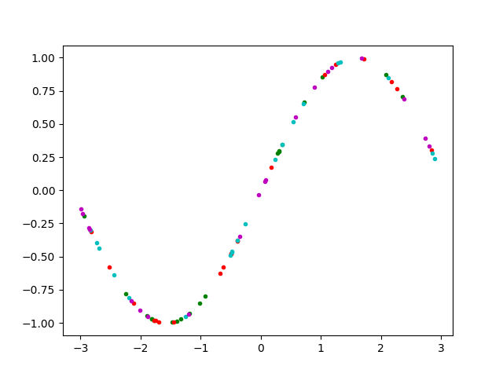

=========================
Simple Local Sin Tutorial
=========================

This introductory tutorial presents a simple example using *libEnsemble* with Python's Multiprocessing.

The end-result of this exercise is a libEnsemble program that splits a batch of uniform randomly-generated numbers from a *Generator Function* ``gen_f`` among multiple workers, where each worker will call a *Simulator Function* ``sim_f`` with a generated value to perform a sin calculation. These generated and simulated values are stored in the history array H.

The following important concepts will be illustrated throughout this tutorial:

  * Basic libEnsemble architecture
  * Configuring libEnsemble for execution with a *calling script*
  * Generator and simulator understanding and construction
  * The H History Array - Accessing, comprehending, and parsing results

Getting started
---------------

First, create an empty directory to store our functions and make sure Python 3 is installed.

.. code-block:: bash

  $ mkdir libe_tutorial
  $ cd libe_tutorial
  $ python3 --version
  Python 3.6.0            # This should be > 3.4

For this tutorial, you need NumPy to perform the calculations and (optionally) Matplotlib to visualize your results. Install these with:

.. code-block:: bash

  $ pip install numpy matplotlib

Calling Script
--------------

Create a new Python file. Lets call it ``hello_libe.py``. Lets import NumPy and libEnsemble, and also write our generator and simulator functions' import statements ahead of time.

.. code-block:: python
  :linenos:

  import numpy as np
  from libensemble.libE import libE
  from generator import gen_uniform_random_sample
  from simulator import sim_find_sin

In the following code we specify the number of *workers* and the type of manager/worker communication libEnsemble will use. Each libEnsemble instance initializes a *manager* process and as many worker processes as the user requests. These workers control and monitor jobs of widely varying sizes and capabilities, including the execution of gen_f and sim_f functions. The manager communicates with the workers via the specified ``'comms'`` mode. In our case, it's 'local' because we're using Python's multiprocessing.

.. code-block:: python
  :linenos:
  :lineno-start: 6

  nworkers = 4
  libE_specs = {'nprocesses': nworkers, 'comms': 'local'}    # Local comms -> single system/node

We store this information in libE_specs, which we later pass to libEnsemble on execution.

Our calling script is a perfect place to outline some settings and specifications for our generator and simulator functions. Recall that our generator function will create random numbers and our simulator function will find the sin of those numbers. ``gen_specs`` and ``sim_specs`` are used to describe to libEnsemble what inputs and outputs from those functions to expect. ``gen_specs`` and ``sim_specs`` are also passed to libEnsemble alongside ``libE_specs``.

.. code-block:: python
  :linenos:
  :lineno-start: 9

  gen_specs = {'gen_f': gen_uniform_random_sample,  # Our generator function
               'in': ['sim_id'],                    # Input field names for 'gen_f'. 'sim_id' good default.
               'out': [('x', float, (1,))],         # Generator output (name, type, size) saved in H
               'lower': np.array([-3]),             # (Optional) boundary for random sampling. Necessary for our work
               'upper': np.array([3]),              # "         "
               'gen_batch_size': 5}                 # (Optional) number of values each worker receives from gen_f

  sim_specs = {'sim_f': sim_find_sin,               # Our simulator function
               'in': ['x'],                         # Input field names for sim_f. 'x' from generator output
               'out': [('y', float)]}               # 'y' = sin('x') . Simulator output saved in H

Each worker is assigned a ``persis_info`` dictionary that contains it's ``RandomState()`` stream for uniform random sampling. This data remains consistent, and (hopefully) prevents unique workers from receiving identical results from generator calls. Finally, we specify the circumstances where libEnsemble should stop execution in ``exit_criteria``.

.. code-block:: python
  :linenos:
  :lineno-start: 20

  persis_info = {}

  for i in range(nworkers+1):                       # Worker numbers start start at 1.
      persis_info[i] = {
          'rand_stream': np.random.RandomState(i),
          'worker_num': i}

  exit_criteria = {'sim_max': 80}                   # Stop libEnsemble after 80 simulations

Now we're (almost) ready to call libEnsemble! H refers to the History array populated throughout execution and returned at the end. It includes helpful information like which workers accessed gen_f and sim_f at what times, and with what data. 'flag' should be zero if no errors occur.

.. code-block:: python
  :linenos:
  :lineno-start: 29

  H, persis_info, flag = libE(sim_specs, gen_specs, exit_criteria, persis_info,
                              libE_specs=libE_specs)

  print([i for i in H.dtype.fields])  # Some statements to visualize our results
  print(H)

Before we run the above code, lets finish our generation and simulation functions.

Gen function
------------

An available worker will call our generator function which creates ``batch`` random numbers uniformly distributed between the ``lower`` and ``upper`` bounds from ``gen_specs``. The random state from ``persis_info`` is used to generate these numbers, which are placed into a NumPy array with field-names and datatypes that match those specified in ``gen_specs``.

Create a new Python file named ``generator.py``. Write the following:

.. code-block:: python
  :linenos:

  import numpy as np

  def gen_uniform_random_sample(H, persis_info, gen_specs, _):  # underscore for internal/testing arguments

      lower = gen_specs['lower']
      upper = gen_specs['upper']

      num = len(lower)                                # Should be 1
      batch = gen_specs['gen_batch_size']             # How many numbers to generate each call by a worker

      out = np.zeros(batch, dtype=gen_specs['out'])   # Output array, with gen_specs specified data type
      out['x'] = persis_info['rand_stream'].uniform(lower, upper, (batch, num))

      return out, persis_info

Notice that H is included as a function argument. A user may want to build on previous simulated or generated values (stored in H) to generate new values.

Sim function
------------

Our simulator function is called by a worker for every value in it's batch from gen_f. This function finds the sin of the passed value, then returns it to be received by a worker for logging to H.

Create a new Python file named ``simulator.py``. Write the following:

.. code-block:: python
  :linenos:

  import numpy as np

  def sim_find_sin(x, persis_info, sim_specs, _): # x is output from gen_f

      out = np.zeros(1, dtype=sim_specs['out'])   # Similar output array
      out['y'] = np.sin(x.view()[0][0])           # Parse out the actual x value from it's array
      return out, persis_info

Now that all these files are completed, lets Run our simulation!

.. code-block:: bash

  $ python3 hello_libe.py

If everything ran perfectly, you should get something similar to the following output for H. The columns might be rearranged.

.. code-block::

  ['y', 'given_time', 'gen_worker', 'sim_worker', 'given', 'returned', 'x', 'allocated', 'sim_id', 'gen_time']
  [(-0.37466051, 1.55968252e+09, 2, 2,  True,  True, [-0.38403059],  True,  0, 1.55968252e+09)
  (-0.29279634, 1.55968252e+09, 2, 3,  True,  True, [-2.84444261],  True,  1, 1.55968252e+09)
  ( 0.29358492, 1.55968252e+09, 2, 4,  True,  True, [ 0.29797487],  True,  2, 1.55968252e+09)
  (-0.3783986 , 1.55968252e+09, 2, 1,  True,  True, [-0.38806564],  True,  3, 1.55968252e+09)
  (-0.45982062, 1.55968252e+09, 2, 2,  True,  True, [-0.47779319],  True,  4, 1.55968252e+09)
  ( 0.3000904 , 1.55968252e+09, 3, 4,  True,  True, [ 0.30478742],  True,  5, 1.55968252e+09)
  ( 0.94863306, 1.55968252e+09, 3, 3,  True,  True, [ 1.24888694],  True,  6, 1.55968252e+09)
  (-0.95041621, 1.55968252e+09, 3, 1,  True,  True, [-1.25457157],  True,  7, 1.55968252e+09)
  ( 0.06491994, 1.55968252e+09, 3, 2,  True,  True, [ 0.06496563],  True,  8, 1.55968252e+09)
  ( 0.70605436, 1.55968252e+09, 3, 4,  True,  True, [ 2.35768173],  True,  9, 1.55968252e+09)
  ( 0.33293422, 1.55968252e+09, 4, 3,  True,  True, [ 2.80217903],  True, 10, 1.55968252e+09)
  ( 0.27961539, 1.55968252e+09, 4, 1,  True,  True, [ 0.2833935 ],  True, 11, 1.55968252e+09)
  ( 0.30075718, 1.55968252e+09, 4, 2,  True,  True, [ 2.83610616],  True, 12, 1.55968252e+09)
  ( 0.96052853, 1.55968252e+09, 4, 3,  True,  True, [ 1.28889596],  True, 13, 1.55968252e+09)
  ( 0.92701483, 1.55968252e+09, 4, 4,  True,  True, [ 1.18637295],  True, 14, 1.55968252e+09)
  (-0.47755342, 1.55968252e+09, 1, 1,  True,  True, [-0.49786797],  True, 15, 1.55968252e+09)
  ( 0.96919645, 1.55968252e+09, 1, 2,  True,  True, [ 1.32194696],  True, 16, 1.55968252e+09)
  (-0.14179936, 1.55968252e+09, 1, 3,  True,  True, [-2.99931375],  True, 17, 1.55968252e+09)
  (-0.92687662, 1.55968252e+09, 1, 4,  True,  True, [-1.18600456],  True, 18, 1.55968252e+09)
  (-0.85321981, 1.55968252e+09, 1, 1,  True,  True, [-2.11946466],  True, 19, 1.55968252e+09)
  ...

In this arrangement, our output values are on the far-left with the generated values being the fourth-column from the right. Again, your columns might be rearranged.

Two additional log files should also have been created, ``ensemble.log`` and ``libE_stats.txt``.
ensemble.log contains logging output from libEnsemble, while libE_stats.txt contains a quick summary of all calculations performed.

I graphed my output using Matplotlib, coloring entries by which worker performed the simulation:

If you want to try this yourself, install Matplotlib and include this code at the bottom of your calling script:

.. code-block:: python
  :linenos:

  import matplotlib.pyplot as plt
  colors = ['b', 'g', 'r', 'c', 'm', 'y', 'k', 'w']

  for i in range(1, nworkers + 1):
      worker_xy = np.extract(H['sim_worker'] == i, H)
      x = [entry.tolist()[0] for entry in worker_xy['x']]
      y = [entry for entry in worker_xy['y']]
      plt.plot(x, y, '.', color = colors[i])

  plt.show()

FAQ
---

Coming soon
