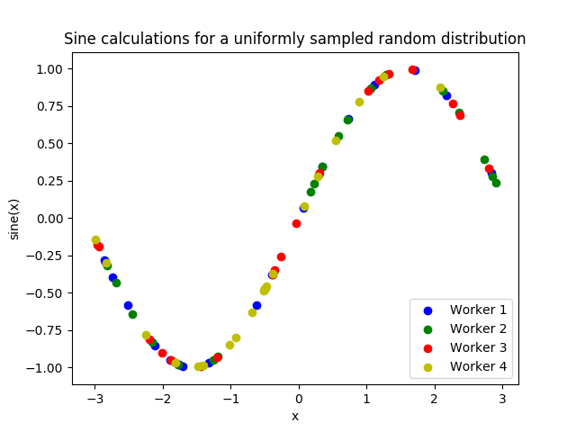

==========================
Simple Local Sine Tutorial
==========================

This introductory tutorial demonstrates the capability to perform ensembles of
calculations in parallel using :doc:`libEnsemble<../introduction>` with Python's
Multiprocessing.

The foundation of writing libEnsemble routines is accounting for four components:

    1. The generator function :ref:`gen_f<api_gen_f>`, which produces values for simulations.
    2. The simulator function :ref:`sim_f<api_sim_f>`, which performs simulations based on values from ``gen_f``.
    3. The allocation function :ref:`alloc_f<api_alloc_f>`, which decides which of the previous two functions should be called, when.
    4. The calling script, which defines parameters and information about these functions and the libEnsemble task, then begins execution.

libEnsemble initializes a *manager* process and as many *worker* processes as the
user requests. The manager coordinates data-transfer between workers and assigns
each units of work, consisting of a ``gen_f`` or ``sim_f`` function to run and
accompanying data. These functions can perform their work in-line with Python or by
launching and controlling user-applications with a :ref:`job controller<jobcontroller_index>`.
Finally, workers pass results back to the manager.

For this tutorial, we'll write our ``gen_f`` and ``sim_f`` entirely in Python
without other applications. Our ``gen_f`` will produce uniform randomly-sampled
values, and our ``sim_f`` will calculate the sine of each. By default we don't
need to write a new allocation function. All generated and simulated values
alongside other parameters are stored in :ref:`H<datastruct-history-array>`,
the History array.

.. _libEnsemble: https://libensemble.readthedocs.io/en/latest/quickstart.html

Getting started
---------------

libEnsemble and it's functions are written entirely in Python_. Let's make sure
Python 3 is installed.

Note: If you have a Python version-specific virtual environment set up (e.g. Conda),
then ``python`` and ``pip`` will work in place of ``python3`` and ``pip3``.

.. code-block:: bash

    $ python3 --version
    Python 3.6.0            # This should be >= 3.5

.. _Python: https://www.python.org/

For this tutorial, you need NumPy_ to perform calculations and (optionally)
Matplotlib_ to visualize your results. Install libEnsemble and these other libraries
with:

.. code-block:: bash

    $ pip3 install numpy
    $ pip3 install libensemble
    $ pip3 install matplotlib # Optional

If your system doesn't allow you to perform the above installations, try adding
``--user`` to the end of each command.

.. _NumPy: https://www.numpy.org/
.. _Matplotlib: https://matplotlib.org/

Generator function
------------------

Let's begin the coding portion of this tutorial by writing our :ref:`gen_f<api_gen_f>`, or generator
function.

An available libEnsemble worker will call this generator function with the following parameters:

* :ref:`H<datastruct-history-array>`: The History array. Updated by the workers
  with ``gen_f`` and ``sim_f`` inputs and outputs, then returned to the user.
  libEnsemble passes ``H`` to the generator function in case the user wants to
  generate new values based on previous data.

* :ref:`persis_info<datastruct-persis-info>`: Dictionary with worker-specific
  information. In our case this dictionary contains mechanisms called random
  streams for generating random numbers.

* :ref:`gen_specs<datastruct-gen-specs>`: Dictionary with user-defined and
  operational parameters for the ``gen_f``. The user places function-specific
  parameters like boundaries and batch-sizes within the nested ``user`` dictionary,
  while parameters that libEnsemble depends on to operate the ``gen_f`` are placed
  outside ``user``.

Later on, we'll populate ``gen_specs`` and ``persis_info`` in our calling script.

For now, create a new Python file named ``generator.py``. Write the following:

.. code-block:: python
    :linenos:
    :caption: examples/tutorials/tutorial_gen.py

    import numpy as np

    def gen_random_sample(H, persis_info, gen_specs, _):
        # underscore parameter for internal/testing arguments

        # Pull out user parameters to perform calculations
        user_specs = gen_specs['user']

        # Get lower and upper bounds from gen_specs
        lower = user_specs['lower']
        upper = user_specs['upper']

        # Determine how many values to generate
        num = len(lower)
        batch_size = user_specs['gen_batch_size']

        # Create array of 'batch_size' zeros
        out = np.zeros(batch_size, dtype=gen_specs['out'])

        # Replace those zeros with the random numbers
        out['x'] = persis_info['rand_stream'].uniform(lower, upper, (batch_size, num))

        # Send back our output and persis_info
        return out, persis_info

Our function creates 'batch_size' random numbers uniformly distributed
between the 'lower' and 'upper' bounds. A random stream
from ``persis_info`` is used to generate these values. Finally, the values are placed
into a NumPy array that meets the specifications from ``gen_specs['out']``.

Simulator function
------------------

Next, we'll write our :ref:`sim_f<api_sim_f>` or simulator function. Simulator
functions perform calculations based on values from the generator function.
The only new parameter here is :ref:`sim_specs<datastruct-sim-specs>`, which serves
a similar purpose to ``gen_specs``.

Create a new Python file named ``simulator.py``. Write the following:

.. code-block:: python
    :linenos:
    :caption: examples/tutorials/tutorial_sim.py

    import numpy as np

    def sim_find_sine(H, persis_info, sim_specs, _):
        # underscore for internal/testing arguments

        # Create an output array of a single zero
        out = np.zeros(1, dtype=sim_specs['out'])

        # Set the zero to the sine of the input value stored in H
        out['y'] = np.sin(H['x'])

        # Send back our output and persis_info
        return out, persis_info

Our simulator function is called by a worker for every value in it's batch from the
generator function. This function calculates the sine of the passed value, then returns
it so a worker can log it into ``H``.

Calling Script
--------------

Now we can write the calling script that configures our generator and simulator
functions and calls libEnsemble.

Create an empty Python file named ``calling_script.py``.
In this file, we'll start by importing NumPy, libEnsemble, and the generator and
simulator functions we just created.

Next, in a dictionary called :ref:`libE_specs<datastruct-libe-specs>` we'll specify
the number of workers and the type of manager/worker communication libEnsemble will
use. Our communication method, ``'local'``, refers to Python's Multiprocessing.

.. code-block:: python
    :linenos:

    import numpy as np
    from libensemble.libE import libE
    from generator import gen_random_sample
    from simulator import sim_find_sine

    nworkers = 4
    libE_specs = {'nworkers': nworkers, 'comms': 'local'}

We configure the settings and specifications for our ``sim_f`` and ``gen_f``
functions in the :ref:`gen_specs<datastruct-gen-specs>` and
:ref:`sim_specs<datastruct-sim-specs>` dictionaries, which we saw previously being
passed to our functions. These dictionaries also describe to libEnsemble what
inputs and outputs from those functions to expect.

.. code-block:: python
    :linenos:

    gen_specs = {'gen_f': gen_random_sample,   # Our generator function
                 'out': [('x', float, (1,))],  # gen_f output (name, type, size)
                 'user': {
                    'lower': np.array([-3]),   # lower boundary for random sampling
                    'upper': np.array([3]),    # upper boundary for random sampling
                    'gen_batch_size': 5        # number of x's gen_f generates per call
                    }
                 }

    sim_specs = {'sim_f': sim_find_sine,       # Our simulator function
                 'in': ['x'],                  # Input field names. 'x' from gen_f output
                 'out': [('y', float)]}        # sim_f output. 'y' = sine('x')

Recall that each worker is assigned an entry in the :ref:`persis_info<datastruct-persis-info>`
dictionary that, in this tutorial, contains  a ``RandomState()`` random stream for
uniform random sampling. We populate that dictionary here using a utility from
the :doc:`utils module<../utilities>`. Finally, we specify the circumstances
where libEnsemble should stop execution in :ref:`exit_criteria<datastruct-exit-criteria>`.

.. code-block:: python
    :linenos:

    persis_info = add_unique_random_streams({}, nworkers+1) # Worker numbers start at 1

    exit_criteria = {'sim_max': 80}           # Stop libEnsemble after 80 simulations

Now we're ready to write our libEnsemble :doc:`libE<../programming_libE>` function call.
This :ref:`H<datastruct-history-array>` is the final version of the History array.
'flag' should be zero if no errors occur.

.. code-block:: python
    :linenos:

    H, persis_info, flag = libE(sim_specs, gen_specs, exit_criteria, persis_info,
                                libE_specs=libE_specs)

    print([i for i in H.dtype.fields])  # (optional) to visualize our History array
    print(H)

That's it! Now that these files are complete, we can run our simulation.

.. code-block:: bash

  $ python3 calling_script.py

If everything ran perfectly and you included the above print-statements, You
should get something similar to the following output for ``H``. The columns might
be rearranged.

.. code-block::

  ['y', 'given_time', 'gen_worker', 'sim_worker', 'given', 'returned', 'x', 'allocated', 'sim_id', 'gen_time']
  [(-0.37466051, 1.559+09, 2, 2,  True,  True, [-0.38403059],  True,  0, 1.559+09)
  (-0.29279634, 1.559+09, 2, 3,  True,  True, [-2.84444261],  True,  1, 1.559+09)
  ( 0.29358492, 1.559+09, 2, 4,  True,  True, [ 0.29797487],  True,  2, 1.559+09)
  (-0.3783986 , 1.559+09, 2, 1,  True,  True, [-0.38806564],  True,  3, 1.559+09)
  (-0.45982062, 1.559+09, 2, 2,  True,  True, [-0.47779319],  True,  4, 1.559+09)
  ...

In this arrangement, our output values are listed on the far-left with the generated
values being the fourth column from the right.

Two additional log files should also have been created.
``ensemble.log`` contains debugging or informational logging output from libEnsemble,
while ``libE_stats.txt`` contains a quick summary of all calculations performed.

I graphed my output using Matplotlib, coloring entries by which worker performed
the simulation:

If you want to verify your results through plotting and installed Matplotlib
earlier, copy and paste the following code into the bottom of your calling script
and run ``python3 calling_script.py`` again

.. code-block:: python
  :linenos:

  import matplotlib.pyplot as plt
  colors = ['b', 'g', 'r', 'y', 'm', 'c', 'k', 'w']

  for i in range(1, nworkers + 1):
      worker_xy = np.extract(H['sim_worker'] == i, H)
      x = [entry.tolist()[0] for entry in worker_xy['x']]
      y = [entry for entry in worker_xy['y']]
      plt.scatter(x, y, label='Worker {}'.format(i), c=colors[i-1])

  plt.title('Sine calculations for a uniformly sampled random distribution')
  plt.xlabel('x')
  plt.ylabel('sine(x)')
  plt.legend(loc = 'lower right')
  plt.show()

---

Next Steps
----------

This is another learning exercise based on the above code.

libEnsemble with MPI
""""""""""""""""""""

MPI_ is a standard interface for parallel computing, implemented in libraries
like MPICH_ and used at extreme scales. MPI potentially allows libEnsemble's manager
and workers to be distributed over multiple nodes and works in some circumstances
where python's multiprocessing does not. In this section, we'll explore modifying the above
code to use MPI instead of multiprocessing.

We recommend MPICH_ for this tutorial, which can be found for a variety of systems
here_. You also need mpi4py which can be downloaded via ``pip3 install mpi4py``.
Again, if this doesn't work try appending ``--user`` to the end of the command.

Verify that MPI has installed correctly with ``mpirun --version``,

Modifying the Calling Script
""""""""""""""""""""""""""""

Only a few changes are necessary to make our code MPI-compatible. Modify the top
of the calling script as follows:

.. code-block:: python
    :linenos:
    :emphasize-lines: 5,7,8,10,11

    import numpy as np
    from libensemble.libE import libE
    from generator import gen_random_sample
    from simulator import sim_find_sine
    from mpi4py import MPI

    # nworkers = 4                                # nworkers will come from MPI
    libE_specs = {'comms': 'mpi'}                 # 'nworkers' removed, 'comms' now 'mpi'

    nworkers = MPI.COMM_WORLD.Get_size() - 1
    is_master = (MPI.COMM_WORLD.Get_rank() == 0)  # master process has MPI rank 0

So that only one process executes the graphing and printing portion of our code,
modify the bottom of the calling script like this:

.. code-block:: python
  :linenos:
  :emphasize-lines: 4

    H, persis_info, flag = libE(sim_specs, gen_specs, exit_criteria, persis_info,
                                libE_specs=libE_specs)

    if is_master:
        # Some (optional) statements to visualize our History array
        print([i for i in H.dtype.fields])
        print(H)

        import matplotlib.pyplot as plt
        colors = ['b', 'g', 'r', 'y', 'm', 'c', 'k', 'w']

        for i in range(1, nworkers + 1):
            worker_xy = np.extract(H['sim_worker'] == i, H)
            x = [entry.tolist()[0] for entry in worker_xy['x']]
            y = [entry for entry in worker_xy['y']]
            plt.scatter(x, y, label='Worker {}'.format(i), c=colors[i-1])

        plt.title('Sine calculations for a uniformly sampled random distribution')
        plt.xlabel('x')
        plt.ylabel('sine(x)')
        plt.legend(loc='lower right')
        plt.show()

With these changes in place, our libEnsemble code can be run with MPI by:

.. code-block:: bash

  $ mpirun -n 5 python3 calling_script.py

Where ``-n 5`` tells ``mpirun`` to produce five processes, one of which will be
the master process with the libEnsemble manager, and the other four will run libEnsemble
workers.

.. _MPI: https://en.wikipedia.org/wiki/Message_Passing_Interface
.. _MPICH: https://www.mpich.org/
.. _here: https://www.mpich.org/downloads/
