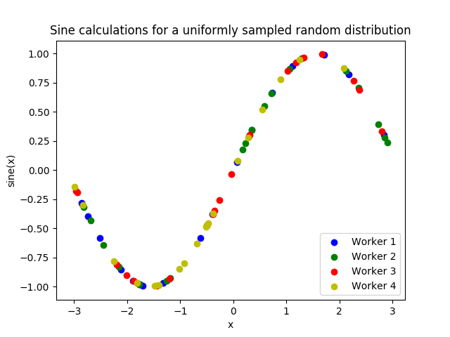

4. Script
=========

`Introduction <local_sine_tutorial.html>`__ \|\| `1. Getting started <local_sine_tutorial_1.html>`__ \|\| `2. Generator <local_sine_tutorial_2.html>`__ \|\| `3. Simulator <local_sine_tutorial_3.html>`__ \|\| **4. Script** \|\| `5. Next steps <local_sine_tutorial_5.html>`__

Now lets write the script that configures our generator and simulator
functions and starts libEnsemble.

Create an empty Python file named ``calling.py``.
In this file, we'll start by importing NumPy, libEnsemble's setup classes, the generator,
and simulator function.

In a class called :ref:`LibeSpecs<datastruct-libe-specs>` we'll
specify the number of workers and the manager/worker intercommunication method.
``"local"``, refers to Python's multiprocessing.

.. literalinclude:: ../../../libensemble/tests/functionality_tests/test_local_sine_tutorial.py
    :language: python
    :linenos:
    :end-at: libE_specs = LibeSpecs

We configure the settings and specifications for our ``sim_f`` and ``gen_f``
functions in the :ref:`GenSpecs<datastruct-gen-specs>` and
:ref:`SimSpecs<datastruct-sim-specs>` classes, which we saw previously
being passed to our functions *as dictionaries*.
These classes also describe to libEnsemble what inputs and outputs from those
functions to expect.

.. literalinclude:: ../../../libensemble/tests/functionality_tests/test_local_sine_tutorial.py
    :language: python
    :linenos:
    :lineno-start: 10
    :start-at: gen_specs = GenSpecs
    :end-at: sim_specs_end_tag

We then specify the circumstances where
libEnsemble should stop execution in :ref:`ExitCriteria<datastruct-exit-criteria>`.

.. literalinclude:: ../../../libensemble/tests/functionality_tests/test_local_sine_tutorial.py
    :language: python
    :linenos:
    :lineno-start: 26
    :start-at: exit_criteria = ExitCriteria
    :end-at: exit_criteria = ExitCriteria

Now we're ready to write our libEnsemble :doc:`libE<../../programming_libE>`
function call. :ref:`ensemble.H<funcguides-history>` is the final version of
the history array. ``ensemble.flag`` should be zero if no errors occur.

.. literalinclude:: ../../../libensemble/tests/functionality_tests/test_local_sine_tutorial.py
    :language: python
    :linenos:
    :lineno-start: 28
    :start-at: ensemble = Ensemble
    :end-at: print(history)

That's it! Now that these files are complete, we can run our simulation.

.. code-block:: bash

    python calling.py

If everything ran perfectly and you included the above print statements, you
should get something similar to the following output (although the
columns might be rearranged).

.. code-block::

    ["y", "sim_started_time", "gen_worker", "sim_worker", "sim_started", "sim_ended", "x", "allocated", "sim_id", "gen_ended_time"]
    [(-0.37466051, 1.559+09, 2, 2,  True,  True, [-0.38403059],  True,  0, 1.559+09)
    (-0.29279634, 1.559+09, 2, 3,  True,  True, [-2.84444261],  True,  1, 1.559+09)
    ( 0.29358492, 1.559+09, 2, 4,  True,  True, [ 0.29797487],  True,  2, 1.559+09)
    (-0.3783986, 1.559+09, 2, 1,  True,  True, [-0.38806564],  True,  3, 1.559+09)
    (-0.45982062, 1.559+09, 2, 2,  True,  True, [-0.47779319],  True,  4, 1.559+09)
    ...

In this arrangement, our output values are listed on the far left with the
generated values being the fourth column from the right.

Two additional log files should also have been created.
``ensemble.log`` contains debugging or informational logging output from
libEnsemble, while ``libE_stats.txt`` contains a quick summary of all
calculations performed.

Here is graphed output using ``Matplotlib``, with entries colored by which
worker performed the simulation:

If you want to verify your results through plotting and installed Matplotlib
earlier, copy and paste the following code into the bottom of your calling
script and run ``python calling.py`` again

.. literalinclude:: ../../../libensemble/tests/functionality_tests/test_local_sine_tutorial.py
    :language: python
    :linenos:
    :lineno-start: 37
    :start-at: import matplotlib
    :end-at: plt.savefig("tutorial_sines.png")

Each of these example files can be found in the repository in `examples/tutorials/simple_sine`_.

**Exercise**

Write a Calling Script with the following specifications:

1. Set the generator function's lower and upper bounds to -6 and 6, respectively
2. Increase the generator batch size to 10
3. Set libEnsemble to stop execution after 160 *generations* using the ``gen_max`` option
4. Print an error message if any errors occurred while libEnsemble was running

.. dropdown:: **Click Here for Solution**

    .. literalinclude:: ../../../libensemble/tests/functionality_tests/test_local_sine_tutorial_2.py
        :language: python
        :linenos:
        :emphasize-lines: 15,16,17,27,33,34

.. _examples/tutorials/simple_sine: https://github.com/Libensemble/libensemble/tree/develop/examples/tutorials/simple_sine
